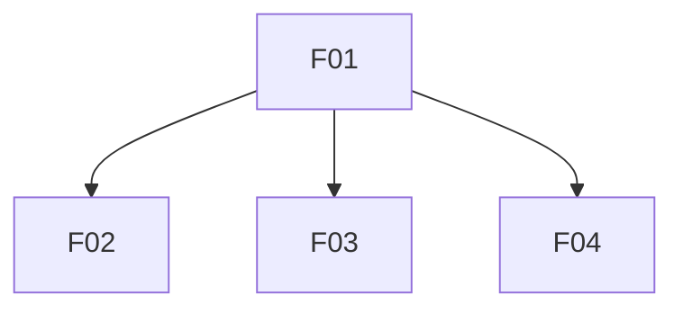

# Features List

| ID | Name | File | Traces to | Status | Summary |
|----|------|------|-----------|--------|---------|
| F01 | Site shell & layout | [F01-site-shell-layout](2-features/F01-site-shell-layout.md) | [GOL-02](stakeholders-and-goals.md#gol-02-brand-credibility) | Specifying | Shared layout, navigation, light corporate theme, and responsive framing for all MVP routes |
| F02 | Home page | [F02-home-page](2-features/F02-home-page.md) | [GOL-01](stakeholders-and-goals.md#gol-01-educate-practitioners), [SCN-01](business-scenarios.md#scn-01-practitioner-discovers), [SCN-02](business-scenarios.md#scn-02-evaluate-benefits) | Specifying | Home marketing content — hero, benefits, how AI agents use structured docs |
| F03 | About page | [F03-about-page](2-features/F03-about-page.md) | [GOL-01](stakeholders-and-goals.md#gol-01-educate-practitioners), [GOL-02](stakeholders-and-goals.md#gol-02-brand-credibility), [SCN-01](business-scenarios.md#scn-01-practitioner-discovers) | Specifying | About page with site owner background and AI Friendly Docs context |
| F04 | Optional LinkedIn contact | [F04-optional-linkedin-contact](2-features/F04-optional-linkedin-contact.md) | [GOL-03](stakeholders-and-goals.md#gol-03-optional-contact), [SCN-03](business-scenarios.md#scn-03-optional-contact) | Specifying | Footer LinkedIn link — understated contact path; no hero CTA |

**Status:** `Draft` · `Specifying` · `Dev-ready` · `In development` · `Implemented` · `Cancelled` — transitions: [03-feature-lifecycle](../.cursor/rules/03-feature-lifecycle.mdc).

## Dependencies

**Rules:** direct deps only; no transitive arrows; no cycles; **Requires** = hard gate for **In development** ([06-traceability](../.cursor/rules/06-traceability.mdc)).
