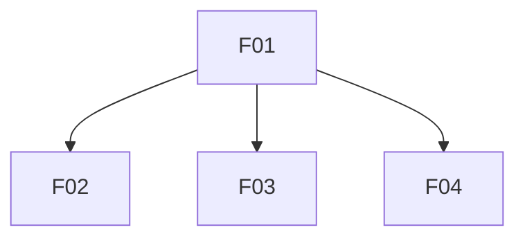

# Features List

| ID | Name | File | Priority | Status | Stakeholders | User Requirements (brief) | Requires | Traces to | Summary |
|----|------|------|----------|--------|--------------|---------------------------|----------|-----------|---------|
| F01 | Site shell & layout | [F01-site-shell-layout](2-features/F01-site-shell-layout.md) | Must | Draft | STK-01, STK-02, STK-03 | Visitor can navigate a polished, responsive site shell so that pages present as enterprise-grade on desktop and mobile | — | [GOL-02](stakeholders-and-goals.md#gol-02-brand-credibility) | Shared layout, navigation, light corporate theme, and responsive framing for all MVP routes |
| F02 | Home page | [F02-home-page](2-features/F02-home-page.md) | Must | Draft | STK-02 | Practitioner can read hero, benefits, and how-it-works on Home so that they understand AI-friendly documentation and its value | F01 | [GOL-01](stakeholders-and-goals.md#gol-01-educate-practitioners), [SCN-01](business-scenarios.md#scn-01-practitioner-discovers), [SCN-02](business-scenarios.md#scn-02-evaluate-benefits) | Home marketing content — hero, benefits, how AI agents use structured docs |
| F03 | About page | [F03-about-page](2-features/F03-about-page.md) | Must | Draft | STK-02, STK-03 | Visitor can read About for owner background and methodology context so that they assess credibility and deepen understanding | F01 | [GOL-01](stakeholders-and-goals.md#gol-01-educate-practitioners), [GOL-02](stakeholders-and-goals.md#gol-02-brand-credibility), [SCN-01](business-scenarios.md#scn-01-practitioner-discovers) | About page with site owner background and AI Friendly Docs context |
| F04 | Optional LinkedIn contact | [F04-optional-linkedin-contact](2-features/F04-optional-linkedin-contact.md) | Should | Draft | STK-03 | Hiring manager can find a subtle LinkedIn link in the footer so that they can reach the site owner without a sales funnel | F01 | [GOL-03](stakeholders-and-goals.md#gol-03-optional-contact), [SCN-03](business-scenarios.md#scn-03-optional-contact) | Footer LinkedIn link — understated contact path; no hero CTA |

**Status:** `Draft` · `Specifying` · `Dev-ready` · `In development` · `Implemented` · `Cancelled` — transitions: [03-feature-lifecycle](../.cursor/rules/03-feature-lifecycle.mdc).

## Dependencies

**Rules:** direct deps only; no transitive arrows; no cycles; **Requires** = hard gate for **In development** ([06-traceability](../.cursor/rules/06-traceability.mdc)).
