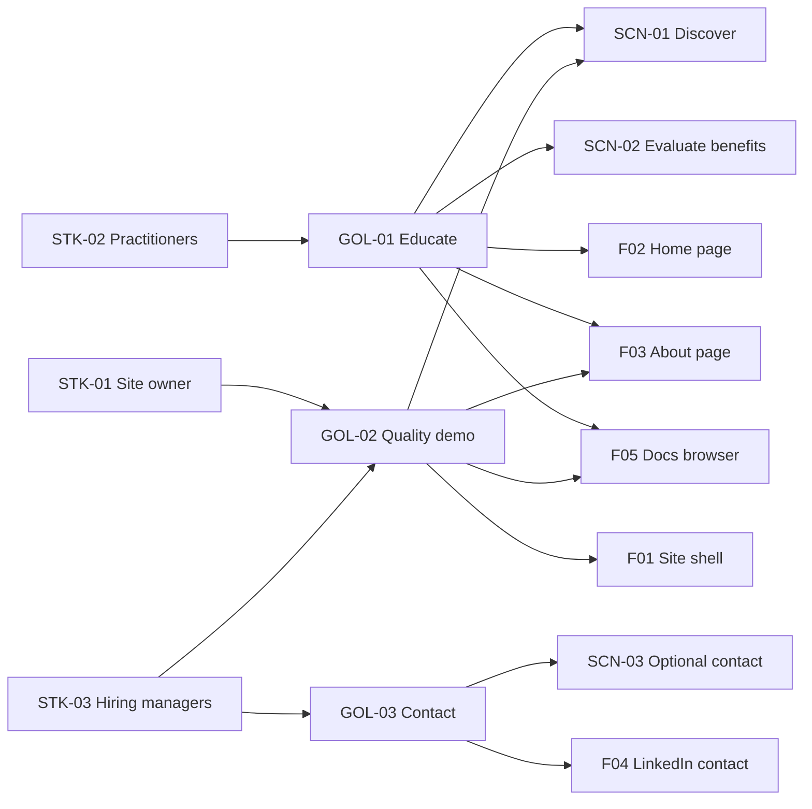

# Stakeholders and Goals

## Stakeholders

| ID | Name | Role | Interest | Influence |
|----|------|------|----------|-----------|
| STK-01 | Site owner | Developer, business analyst, system analyst; creator of [AI Friendly Docs](#gol-02-brand-credibility) | Showcase methodology quality; attract practitioner interest; optional hiring inquiries | High |
| STK-02 | Practitioners | Developers, business analysts, product managers exploring documentation practices | Understand what AI-friendly documentation is, its benefits, and how it improves delivery quality | High |
| STK-03 | Hiring managers | Decision-makers at companies evaluating analyst/consulting talent | Assess credibility and professional output quality via the site itself | Medium |

## Goals

| ID | Goal | Success Metric | Stakeholder(s) | Priority |
|----|------|----------------|----------------|----------|
| GOL-01 | Educate practitioners on AI-friendly documentation | Home and About clearly explain the concept, benefits (rapid doc development, test coverage, quality, legacy modernization), and how AI agents use text-first docs; the **Docs** route lets practitioners browse this product’s live documentation tree; a practitioner can summarize the approach after one visit | STK-02 | Must |
| GOL-02 | Demonstrate professional, enterprise-grade quality through the site itself | Site presents as polished corporate-consulting quality (light theme, trust-focused layout, consistent typography); no broken layouts on desktop and mobile viewports | STK-01, STK-03 | Must |
| GOL-03 | Provide optional contact path without overshadowing educational content | LinkedIn link appears in About and/or footer only; no prominent hire-me hero CTA | STK-03 | Should |

## Goal map

## Non-Goals

- Browsing arbitrary third-party documentation sets or uploading user-owned doc trees (this product’s repository docs only)
- Prominent hire-me funnel, lead forms, or hero-level contact CTAs
- Multi-language support at launch (English only)
- User accounts, CMS admin UI, or dynamic content management in MVP
- Case-study portfolio pages or client logos in MVP (focused Home + About only)

## Assumptions

- Primary traffic is practitioners researching documentation approaches, not buyers completing a purchase flow
- Content is static marketing copy authored in the repository and deployed from source
- LinkedIn contact link: [Mikhail Shumilov](https://www.linkedin.com/in/mikhail-shumilov-549a57292/) — used in About and footer
- The **AI Friendly Docs** brand names the methodology; the site owner’s personal identity appears primarily on the About page

## Constraints

- **Stack:** Next.js static/marketing site per solution strategy (to be documented in `3-arch/`)
- **Hosting:** Vercel
- **Language:** English only at launch
- **Page scope (MVP):** Home (hero, benefits, how it works), About, **Docs** (product documentation browser), footer with LinkedIn
- **Visual direction:** Corporate consulting — light theme, trust-focused, enterprise-friendly
- **Demonstration model:** Home and About explain the methodology in prose; the **Docs** route (`/docs`) embeds a read-only browser of this product’s numbered documentation folders (`1-scope/`–`5-dev/`) as a live quality demo
