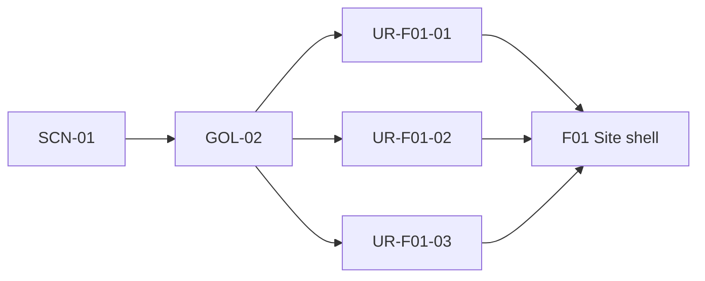
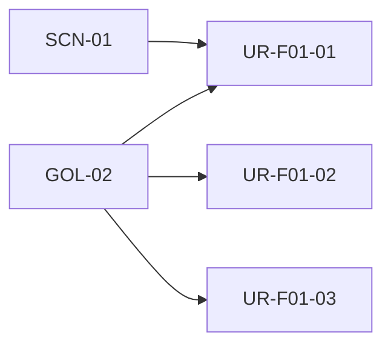
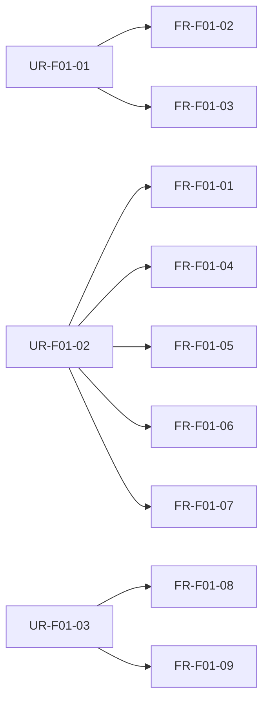
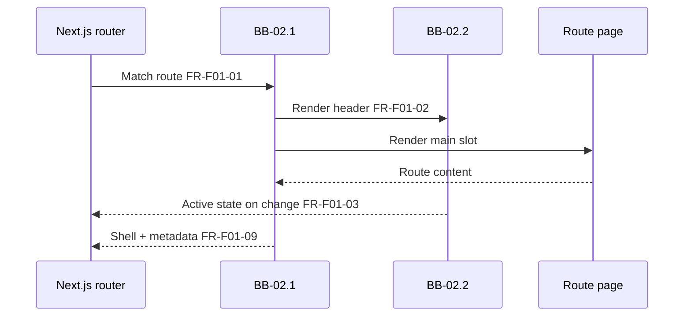

# F01: Site shell & layout

## Overview

**Intent:** Provide a shared responsive Next.js site shell — header with **AI Friendly Docs** branding and Home/About navigation, a main content slot for route pages, and a footer frame (copyright and methodology tagline) — using a light corporate theme on all MVP routes.

**Scope:** **In:** root layout, header brand and nav (Home, About, Docs per [F05](F05-documentation-browser.md)), hamburger menu on narrow viewports, active nav state, centered max-width content column (~1200px) with full-bleed header/footer bands, footer frame, semantic landmarks (`header` / `main` / `footer`), shared page title and metadata template, 404 page using the same shell. **Out:** Home and About page copy and sections ([F02](F02-home-page.md), [F03](F03-about-page.md)); Docs browser layout and rendering ([F05](F05-documentation-browser.md)); LinkedIn contact link ([F04](F04-optional-linkedin-contact.md)); analytics, CMS, or authenticated areas.

**Trace:** [SCN-01](../1-scope/business-scenarios.md#scn-01-practitioner-discovers), [GOL-02](../1-scope/stakeholders-and-goals.md#gol-02-brand-credibility); [NFR-01](../3-arch/solution-strategy.md#nfr-01-responsive-layout), [NFR-02](../3-arch/solution-strategy.md#nfr-02-accessibility), [NFR-03](../3-arch/solution-strategy.md#nfr-03-performance-seo), [NFR-04](../3-arch/solution-strategy.md#nfr-04-static-architecture)

**Blocks:** [BB-02 Site Shell](../3-arch/building-blocks.md#bb-02-site-shell) shared chrome; [BB-05 Design System](../3-arch/building-blocks.md#bb-05-design-system) theme tokens

**Requires:** —

## Overview trace



## User requirements

| ID | Requirement | Parent |
|----|-------------|--------|
| UR-F01-01 | Visitor can navigate between Home and About using a consistent header so that they can explore the site without disorientation | [GOL-02](../1-scope/stakeholders-and-goals.md#gol-02-brand-credibility), [SCN-01](../1-scope/business-scenarios.md#scn-01-practitioner-discovers) |
| UR-F01-02 | Visitor sees a polished, responsive layout on desktop and mobile viewports so that the site demonstrates enterprise-grade quality | [GOL-02](../1-scope/stakeholders-and-goals.md#gol-02-brand-credibility) |
| UR-F01-03 | Visitor receives correct page titles and semantic page structure so that content is accessible and trustworthy | [GOL-02](../1-scope/stakeholders-and-goals.md#gol-02-brand-credibility) |

## UR trace



## Functional requirements

| ID | Type | Requirement | Parent | Block | Acceptance |
|----|------|-------------|--------|-------|------------|
| FR-F01-01 | functional | Root layout shall render header, main content slot, and footer on every MVP route | UR-F01-02 | [BB-02.1](../3-arch/building-blocks.md#bb-021-root-layout--metadata) | Given any in-scope route, when the page loads, then header, main, and footer are visible and main wraps route content |
| FR-F01-02 | functional | Header shall display **AI Friendly Docs** as the site brand linking to Home | UR-F01-01 | [BB-02.2](../3-arch/building-blocks.md#bb-022-header--navigation) | Given any page, when the visitor clicks the brand, then they navigate to Home |
| FR-F01-03 | functional | Header navigation shall expose **Home**, **About**, and **Docs**, with active state on the current route | UR-F01-01 | [BB-02.2](../3-arch/building-blocks.md#bb-022-header--navigation) | Given the visitor is on About, when they view the header, then About is marked active and Home and Docs are not |
| FR-F01-04 | functional | Navigation shall collapse to a hamburger menu below the mobile breakpoint | UR-F01-02 | [BB-02.2](../3-arch/building-blocks.md#bb-022-header--navigation) | Given a viewport below the mobile breakpoint, when the page loads, then nav links are behind a menu control until opened |
| FR-F01-05 | functional | Main content shall use a centered max-width column (~1200px); header and footer bands may span full viewport width | UR-F01-02 | [BB-02.1](../3-arch/building-blocks.md#bb-021-root-layout--metadata) | Given desktop width, when content renders, then text blocks do not exceed ~1200px centered while header/footer bands are full-bleed |
| FR-F01-06 | functional | Footer frame shall show copyright and an optional methodology tagline; LinkedIn link is out of scope for F01 | UR-F01-02 | [BB-02.3](../3-arch/building-blocks.md#bb-023-footer-frame) | Given any page, when the footer renders, then copyright (and tagline if present) appear and no LinkedIn link is shown |
| FR-F01-07 | functional | Layout shall apply a light corporate theme — consistent typography, spacing, and colour tokens across shell elements | UR-F01-02 | [BB-05](../3-arch/building-blocks.md#bb-05-design-system) | Given Home and About, when the visitor switches routes, then header, footer, and shell styling remain consistent |
| FR-F01-08 | functional | Unknown routes shall render a 404 page within the same site shell | UR-F01-03 | [BB-02.1](../3-arch/building-blocks.md#bb-021-root-layout--metadata) | Given an invalid path, when the visitor opens it, then they see the shell plus a clear not-found message |
| FR-F01-09 | functional | Each route shall set document title (and base metadata) via a shared template | UR-F01-03 | [BB-02.1](../3-arch/building-blocks.md#bb-021-root-layout--metadata) | Given Home or About, when the page loads, then the browser title reflects the route name using the shared template |

## FR trace



## UI flow

1. **Visitor** on **any MVP route** — sees header with **AI Friendly Docs** brand and Home/About nav; main slot shows route content from F02 or F03 (FR-F01-01, FR-F01-02, FR-F01-03).
2. **Visitor** on **narrow viewport** — opens hamburger menu, selects Home or About (FR-F01-04).
3. **Visitor** on **unknown URL** — sees 404 message inside the same shell (FR-F01-08).

**Not in F01:** Home hero, benefits, and how-it-works sections (F02); About page body and owner bio (F03); footer LinkedIn link (F04).

**Mockups:** [MCK-01](../4-design/mockups.md#mck-01-site-shell) shell, [MCK-02](../4-design/mockups.md#mck-02-mobile-nav) mobile nav, [MCK-14](../4-design/mockups.md#mck-14-not-found) 404

## UI flow diagram

```mermaid
sequenceDiagram
    actor Visitor
    participant Shell as Site shell
    participant Page as Route page (F02/F03)
    Visitor->>Shell: Load route FR-F01-01
    Shell->>Page: Render children in main slot
    Visitor->>Shell: Click nav link FR-F01-03
    Shell->>Page: Navigate; update active state
```

## Runtime flow

1. **[BB-02.1](../3-arch/building-blocks.md#bb-021-root-layout--metadata)** — wraps all MVP routes with header, `{children}` main slot, and footer (FR-F01-01).
2. **[BB-02.2](../3-arch/building-blocks.md#bb-022-header--navigation)** — updates active nav state on route change without full shell remount (FR-F01-03).
3. **[BB-02.1](../3-arch/building-blocks.md#bb-021-root-layout--metadata)** — applies shared title template per route via Metadata API (FR-F01-09).

Shared internals: see [building-blocks.md](../3-arch/building-blocks.md) § Level 2 — BB-02.

**Notable aspects:** Static marketing site — no auth, no server-side business logic, no persistent data in F01. 404 served as a standard not-found route (FR-F01-08).

**See also:** [RT-01](../3-arch/runtime-views.md#rt-01-practitioner-cross-route-journey) cross-route journey

## Runtime diagram



## Data model

*(none — static marketing site; F01 has no persistent entities)*
