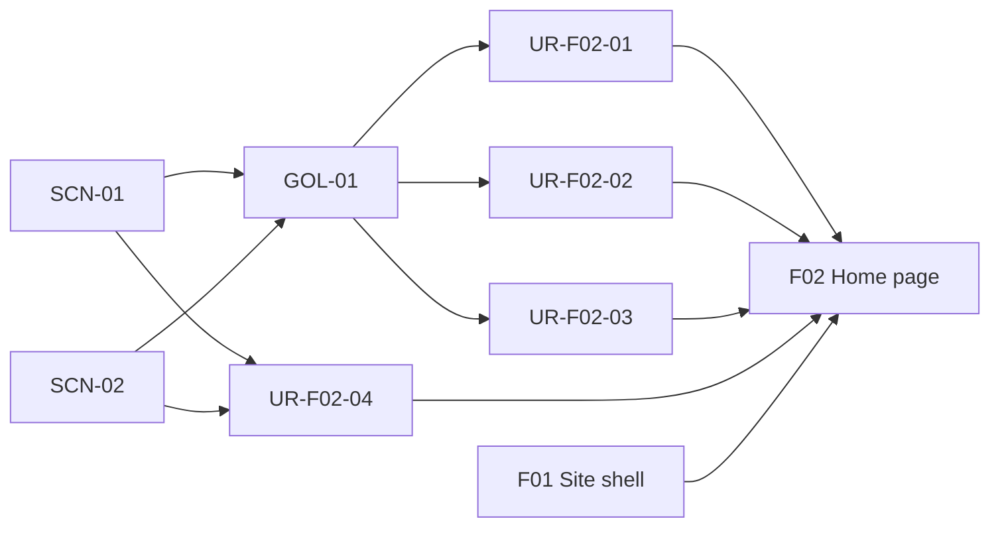
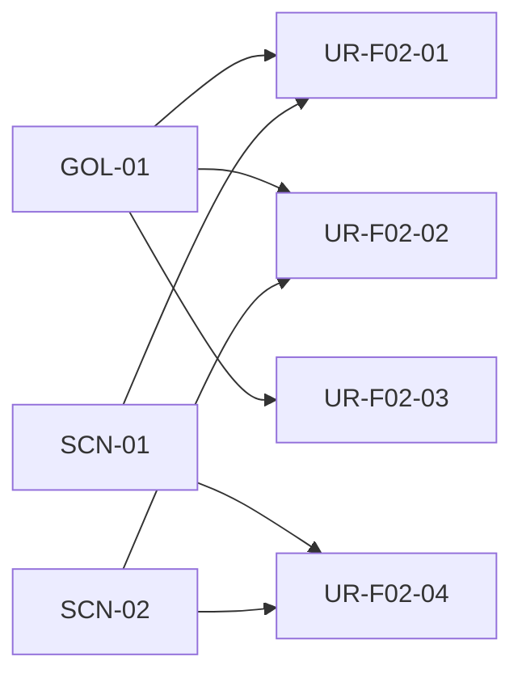
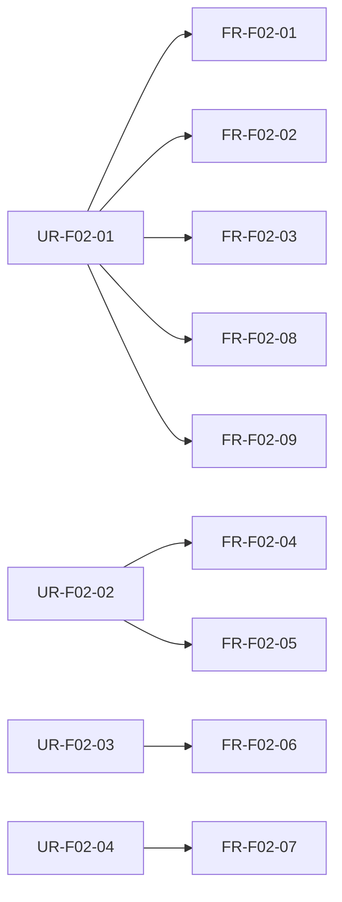
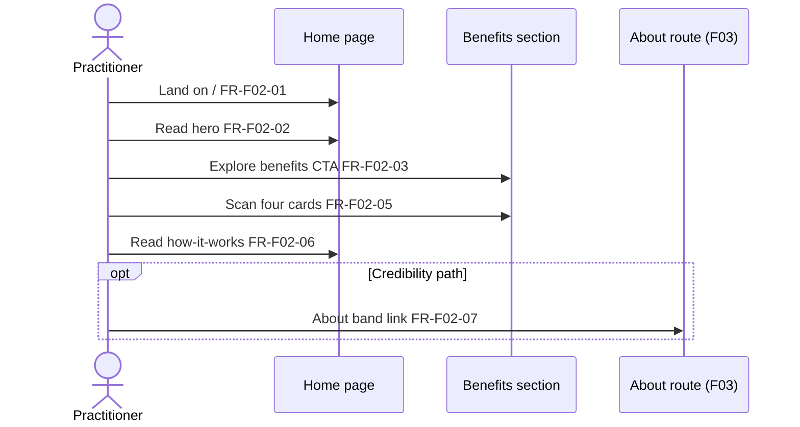
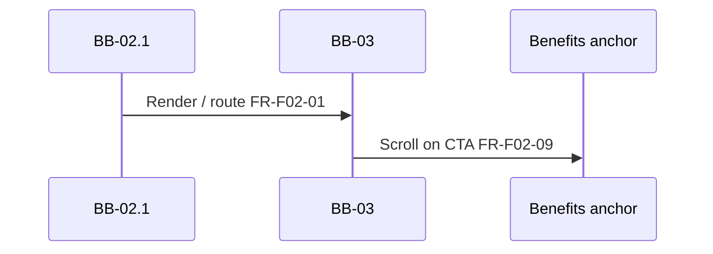

# F02: Home page

## Overview

**Intent:** Deliver the Home marketing route (`/`) inside the F01 shell — a methodology-first **hero**, a **four-card benefits grid**, a **three-step how-it-works** section, and a soft **About band** — so practitioners quickly understand AI-friendly documentation and can assess team fit.

**Scope:** **In:** hero (headline, subhead, scroll-to-benefits CTA), benefits grid (rapid docs, test coverage, quality, legacy modernization), how-it-works steps, closing About prompt, Home route metadata, in-page anchor scroll. **Out:** site shell and global nav ([F01](F01-site-shell-layout.md)); About page body ([F03](F03-about-page.md)); LinkedIn or hire-me CTAs ([F04](F04-optional-linkedin-contact.md), scope non-goals); live doc browser, case studies, forms, or CMS-driven content.

**Trace:** [GOL-01](../1-scope/stakeholders-and-goals.md#gol-01-educate-practitioners), [SCN-01](../1-scope/business-scenarios.md#scn-01-practitioner-discovers), [SCN-02](../1-scope/business-scenarios.md#scn-02-evaluate-benefits); [NFR-01](../3-arch/solution-strategy.md#nfr-01-responsive-layout), [NFR-02](../3-arch/solution-strategy.md#nfr-02-accessibility), [NFR-03](../3-arch/solution-strategy.md#nfr-03-performance-seo), [NFR-04](../3-arch/solution-strategy.md#nfr-04-static-architecture)

**Blocks:** [BB-03 Home Page](../3-arch/building-blocks.md#bb-03-home-page) marketing sections; [BB-02.1](../3-arch/building-blocks.md#bb-021-root-layout--metadata) main slot host

**Requires:** [F01 Site shell & layout](F01-site-shell-layout.md)

## Overview trace

## User requirements

| ID | Requirement | Parent |
|----|-------------|--------|
| UR-F02-01 | Practitioner can read the Home hero and grasp what [AI-friendly documentation](../1-scope/glossary.md) is so that they understand the methodology within one visit | [GOL-01](../1-scope/stakeholders-and-goals.md#gol-01-educate-practitioners), [SCN-01](../1-scope/business-scenarios.md#scn-01-practitioner-discovers) |
| UR-F02-02 | Practitioner can scan four benefit summaries so that they can judge whether the approach fits their team or project | [GOL-01](../1-scope/stakeholders-and-goals.md#gol-01-educate-practitioners), [SCN-02](../1-scope/business-scenarios.md#scn-02-evaluate-benefits) |
| UR-F02-03 | Practitioner can follow a concise three-step workflow explanation so that they see how structured docs connect to AI assistance, validation, and delivery | [GOL-01](../1-scope/stakeholders-and-goals.md#gol-01-educate-practitioners), [SCN-01](../1-scope/business-scenarios.md#scn-01-practitioner-discovers) |
| UR-F02-04 | Visitor can continue to About from Home so that they can assess author credibility after reading marketing content | [SCN-01](../1-scope/business-scenarios.md#scn-01-practitioner-discovers), [SCN-02](../1-scope/business-scenarios.md#scn-02-evaluate-benefits) |

## UR trace

## Functional requirements

| ID | Type | Requirement | Parent | Block | Acceptance |
|----|------|-------------|--------|-------|------------|
| FR-F02-01 | functional | Home shall render at `/` inside the F01 shell main content slot | UR-F02-01 | [BB-03](../3-arch/building-blocks.md#bb-03-home-page), [BB-02.1](../3-arch/building-blocks.md#bb-021-root-layout--metadata) | Given the site is loaded, when the visitor opens `/`, then F01 shell wraps Home sections |
| FR-F02-02 | functional | Hero shall use a methodology-first headline and subhead explaining text-first structured documentation for humans and AI agents | UR-F02-01 | [BB-03](../3-arch/building-blocks.md#bb-03-home-page) | Given Home loads, when the visitor reads the hero, then the headline leads with the documentation approach and the subhead mentions structured text and AI agent use |
| FR-F02-03 | functional | Hero shall include an **Explore benefits** CTA that scrolls to the benefits section; no contact, hire-me, or LinkedIn hero CTA | UR-F02-01 | [BB-03](../3-arch/building-blocks.md#bb-03-home-page) | Given Home loads, when the visitor activates the hero CTA, then the viewport scrolls to the benefits section and no contact CTA is present in the hero |
| FR-F02-04 | functional | Benefits section shall display four cards in a responsive grid | UR-F02-02 | [BB-03](../3-arch/building-blocks.md#bb-03-home-page) | Given Home loads, when the visitor views benefits, then four distinct cards are visible and reflow on narrow viewports |
| FR-F02-05 | functional | Benefit cards shall cover **rapid documentation development**, **test coverage generation and maintenance**, **higher software quality**, and **legacy modernization** — each with a title and 2–3 sentence blurb | UR-F02-02 | [BB-03](../3-arch/building-blocks.md#bb-03-home-page) | Given Home loads, when the visitor reads each card, then all four topics are present with title plus short prose (not bullet-only lists) |
| FR-F02-06 | functional | How-it-works section shall present three numbered steps: structured text docs → AI-assisted elaboration and validation → implementation and tests | UR-F02-03 | [BB-03](../3-arch/building-blocks.md#bb-03-home-page) | Given Home loads, when the visitor reads how-it-works, then exactly three ordered steps appear in that sequence |
| FR-F02-07 | functional | Home shall end with a soft About band linking to the About route (e.g. **Who built this?** / **About the author**) | UR-F02-04 | [BB-03](../3-arch/building-blocks.md#bb-03-home-page) | Given Home loads, when the visitor reaches the page bottom, then a link to About is visible and no contact form or LinkedIn CTA appears in the band |
| FR-F02-08 | functional | Home route shall set page title and description via the F01 metadata template | UR-F02-01 | [BB-02.1](../3-arch/building-blocks.md#bb-021-root-layout--metadata) | Given Home loads, when the document metadata is inspected, then title reflects Home using the shared template |
| FR-F02-09 | functional | Benefits section shall expose a stable anchor id for in-page scroll from the hero CTA | UR-F02-01 | [BB-03](../3-arch/building-blocks.md#bb-03-home-page) | Given Home loads, when the hero CTA is activated, then the benefits section receives focus without navigation away from Home |

## FR trace

## UI flow

1. **Practitioner** lands on **Home** — reads methodology-first hero and subhead (FR-F02-01, FR-F02-02).
2. **Practitioner** clicks **Explore benefits** — page scrolls to the benefits grid (FR-F02-03, FR-F02-09).
3. **Practitioner** scans **four benefit cards** — evaluates rapid docs, test coverage, quality, and legacy modernization blurbs (FR-F02-04, FR-F02-05).
4. **Practitioner** reads **How it works** — three-step workflow from structured docs to delivery (FR-F02-06).
5. **Visitor** (optional) follows **About band** — navigates to About for credibility (FR-F02-07); alternate path from SCN-02 before judgment.

**Not in F02:** Header, footer frame, global nav (F01); About page content (F03); footer LinkedIn (F04); embedded documentation browser; testimonials or case-study portfolio.

**Mockups:** [MCK-03](../4-design/mockups.md#mck-03-home-hero) hero, [MCK-04](../4-design/mockups.md#mck-04-home-benefits) benefits, [MCK-05](../4-design/mockups.md#mck-05-home-how-it-works) how-it-works, [MCK-06](../4-design/mockups.md#mck-06-home-full-desktop) / [MCK-07](../4-design/mockups.md#mck-07-home-full-mobile) full page

## UI flow diagram

## Runtime flow

1. **[BB-03](../3-arch/building-blocks.md#bb-03-home-page)** — renders static marketing sections as `{children}` inside [BB-02.1](../3-arch/building-blocks.md#bb-021-root-layout--metadata) root layout (FR-F02-01).
2. **[BB-03](../3-arch/building-blocks.md#bb-03-home-page)** — hero CTA targets benefits section id without full page reload (FR-F02-03, FR-F02-09).
3. **[BB-02.1](../3-arch/building-blocks.md#bb-021-root-layout--metadata)** — Home exports title and description through shared metadata template (FR-F02-08).

**Notable aspects:** Static content authored in repository; no API calls, auth, or client-side data fetching. About band uses standard client navigation to `/about`.

**See also:** [RT-01](../3-arch/runtime-views.md#rt-01-practitioner-cross-route-journey) cross-route journey

## Runtime diagram

## Data model

*(none — static marketing content; F02 has no persistent entities)*
