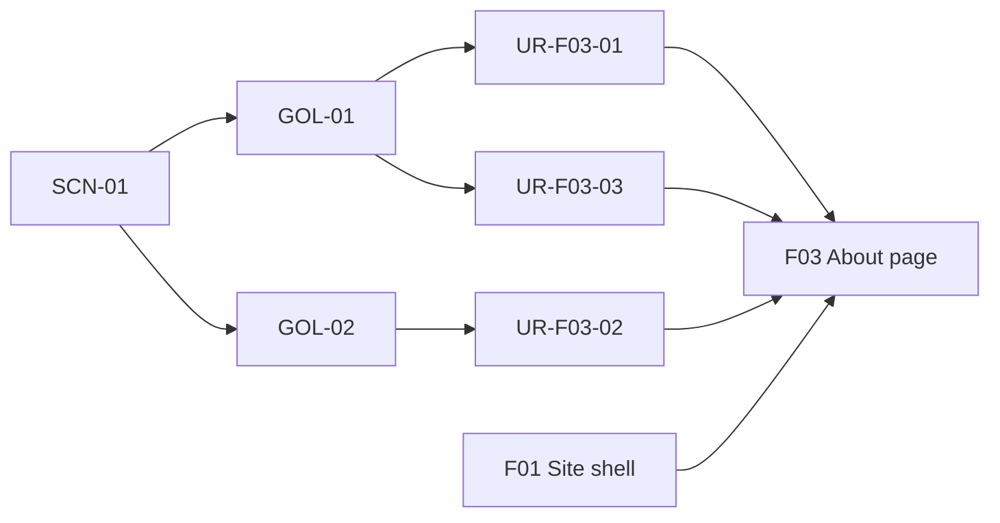
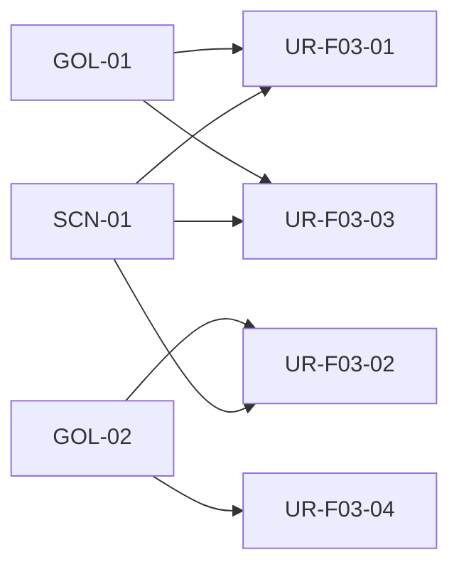
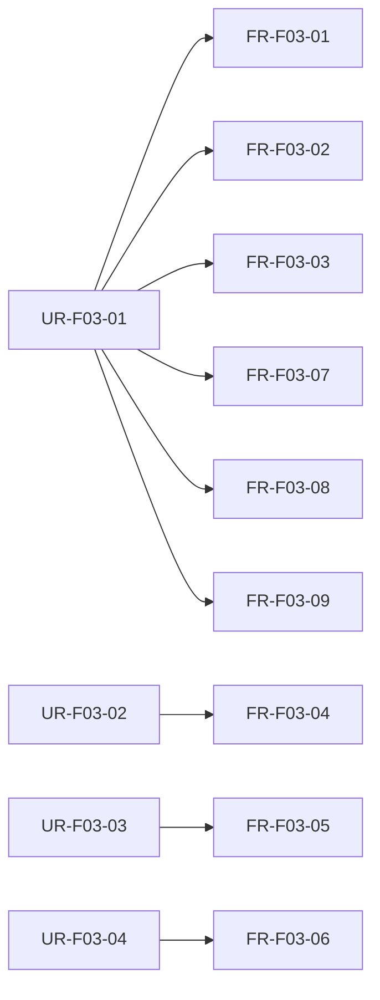
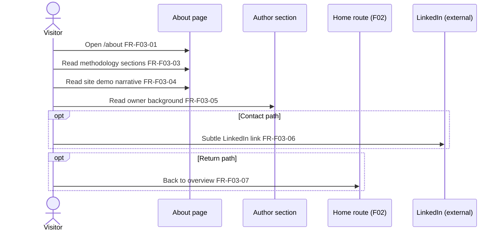
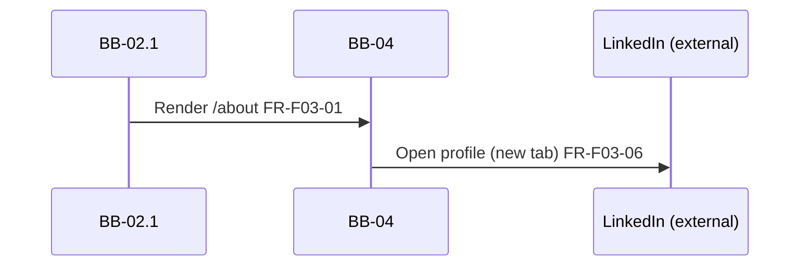

# F03: About page

## Overview

**Intent:** Deliver the About route (`/about`) inside the F01 shell — a short **page hero**, three prose sections (**What AI Friendly Docs is**, **Why this site exists**, **About the author** with a subtle LinkedIn link), and a **Back to Home** band — so visitors deepen methodology understanding and assess author credibility after Home.

**Scope:** **In:** page hero, methodology explanation, site-as-demo narrative, owner background (developer, business analyst, system analyst), subtle in-page LinkedIn text link, About route metadata, closing Home link. **Out:** site shell and global nav ([F01](F01-site-shell-layout.md)); Home marketing sections ([F02](F02-home-page.md)); footer LinkedIn link ([F04](F04-optional-linkedin-contact.md)); author photo/avatar, case-study portfolio, client logos, forms, or CMS-driven content.

**Trace:** [GOL-01](../1-scope/stakeholders-and-goals.md#gol-01-educate-practitioners), [GOL-02](../1-scope/stakeholders-and-goals.md#gol-02-brand-credibility), [SCN-01](../1-scope/business-scenarios.md#scn-01-practitioner-discovers); [NFR-01](../3-arch/solution-strategy.md#nfr-01-responsive-layout), [NFR-02](../3-arch/solution-strategy.md#nfr-02-accessibility), [NFR-03](../3-arch/solution-strategy.md#nfr-03-performance-seo), [NFR-04](../3-arch/solution-strategy.md#nfr-04-static-architecture), [NFR-05](../3-arch/solution-strategy.md#nfr-05-external-link-security)

**Blocks:** [BB-04 About Page](../3-arch/building-blocks.md#bb-04-about-page) content sections; [BB-02.1](../3-arch/building-blocks.md#bb-021-root-layout--metadata) main slot host

**Requires:** [F01 Site shell & layout](F01-site-shell-layout.md)

## Overview trace

## User requirements

| ID | Requirement | Parent |
|----|-------------|--------|
| UR-F03-01 | Practitioner can read an expanded explanation of [AI Friendly Docs](../1-scope/glossary.md) on About so that they understand the methodology beyond the Home summary | [GOL-01](../1-scope/stakeholders-and-goals.md#gol-01-educate-practitioners), [SCN-01](../1-scope/business-scenarios.md#scn-01-practitioner-discovers) |
| UR-F03-02 | Visitor can see why this marketing site exists as a demonstration of professional, enterprise-grade output so that they trust the approach | [GOL-02](../1-scope/stakeholders-and-goals.md#gol-02-brand-credibility), [SCN-01](../1-scope/business-scenarios.md#scn-01-practitioner-discovers) |
| UR-F03-03 | Visitor can read the site owner’s developer, business analyst, and system analyst background so that they can assess author credibility | [GOL-01](../1-scope/stakeholders-and-goals.md#gol-01-educate-practitioners), [SCN-01](../1-scope/business-scenarios.md#scn-01-practitioner-discovers) |
| UR-F03-04 | Hiring manager or interested visitor can find a subtle LinkedIn link on About so that they may contact the site owner without a prominent sales funnel | [GOL-02](../1-scope/stakeholders-and-goals.md#gol-02-brand-credibility), [SCN-01](../1-scope/business-scenarios.md#scn-01-practitioner-discovers) |

## UR trace

## Functional requirements

| ID | Type | Requirement | Parent | Block | Acceptance |
|----|------|-------------|--------|-------|------------|
| FR-F03-01 | functional | About shall render at `/about` inside the F01 shell main content slot | UR-F03-01 | [BB-04](../3-arch/building-blocks.md#bb-04-about-page), [BB-02.1](../3-arch/building-blocks.md#bb-021-root-layout--metadata) | Given the site is loaded, when the visitor opens `/about`, then F01 shell wraps About sections |
| FR-F03-02 | functional | About shall open with a short page hero — title (e.g. **About AI Friendly Docs**) and a one-line intro | UR-F03-01 | [BB-04](../3-arch/building-blocks.md#bb-04-about-page) | Given About loads, when the visitor reads the top of the page, then a distinct hero heading and intro line appear before section content |
| FR-F03-03 | functional | First content section shall explain **What AI Friendly Docs is** — text-first structured documentation for humans and AI agents | UR-F03-01 | [BB-04](../3-arch/building-blocks.md#bb-04-about-page) | Given About loads, when the visitor reads section 1, then the methodology is explained in prose without duplicating the entire Home benefits grid |
| FR-F03-04 | functional | Second section shall explain **Why this site exists** — the site as a quality demonstration of the documentation approach | UR-F03-02 | [BB-04](../3-arch/building-blocks.md#bb-04-about-page) | Given About loads, when the visitor reads section 2, then the narrative states the site demonstrates professional output quality |
| FR-F03-05 | functional | Third section shall present **About the author** — site owner background spanning developer, business analyst, and system analyst roles; text only, no photo in MVP | UR-F03-03 | [BB-04](../3-arch/building-blocks.md#bb-04-about-page) | Given About loads, when the visitor reads section 3, then owner roles and background appear and no author photo is shown |
| FR-F03-06 | functional | Author section shall include a subtle LinkedIn text link to [Mikhail Shumilov](https://www.linkedin.com/in/mikhail-shumilov-549a57292/) opening in a new tab; no hire-me banner or form | UR-F03-04 | [BB-04](../3-arch/building-blocks.md#bb-04-about-page) | Given About loads, when the visitor views the author section, then a low-emphasis LinkedIn link is present and no contact form or hero-level CTA appears |
| FR-F03-07 | functional | About shall end with a soft **Back to overview** (or equivalent) link to Home | UR-F03-01 | [BB-04](../3-arch/building-blocks.md#bb-04-about-page) | Given About loads, when the visitor reaches the page bottom, then a link to `/` is visible |
| FR-F03-08 | functional | About route shall set page title and description via the F01 metadata template | UR-F03-01 | [BB-02.1](../3-arch/building-blocks.md#bb-021-root-layout--metadata) | Given About loads, when document metadata is inspected, then title reflects About using the shared template |
| FR-F03-09 | functional | Section order shall be: hero → What AI Friendly Docs is → Why this site exists → About the author → Home link band | UR-F03-01 | [BB-04](../3-arch/building-blocks.md#bb-04-about-page) | Given About loads, when sections are read top to bottom, then they appear in that order |

## FR trace

## UI flow

1. **Visitor** navigates to **About** via header nav or F02 About band — sees page hero (FR-F03-01, FR-F03-02).
2. **Practitioner** reads **What AI Friendly Docs is** — expanded methodology context (FR-F03-03).
3. **Visitor** reads **Why this site exists** — site as quality demo (FR-F03-04).
4. **Visitor** reads **About the author** — owner roles and background; optional subtle LinkedIn link (FR-F03-05, FR-F03-06).
5. **Visitor** (optional) follows **Back to overview** — returns to Home (FR-F03-07).

**Not in F03:** Header, footer frame, global nav (F01); Home hero, benefits, how-it-works (F02); footer LinkedIn placement (F04); portfolio pages, client logos, author photo, lead forms.

**Mockups:** [MCK-08](../4-design/mockups.md#mck-08-about-hero) hero, [MCK-09](../4-design/mockups.md#mck-09-about-methodology) methodology, [MCK-10](../4-design/mockups.md#mck-10-about-site-narrative) site narrative, [MCK-11](../4-design/mockups.md#mck-11-about-author) author, [MCK-12](../4-design/mockups.md#mck-12-about-full-desktop) / [MCK-13](../4-design/mockups.md#mck-13-about-full-mobile) full page

## UI flow diagram

## Runtime flow

1. **[BB-04](../3-arch/building-blocks.md#bb-04-about-page)** — renders static marketing sections as `{children}` inside [BB-02.1](../3-arch/building-blocks.md#bb-021-root-layout--metadata) root layout (FR-F03-01).
2. **[BB-04](../3-arch/building-blocks.md#bb-04-about-page)** — LinkedIn anchor opens in a new browser tab from author section (FR-F03-06).
3. **[BB-02.1](../3-arch/building-blocks.md#bb-021-root-layout--metadata)** — About exports title and description through shared metadata template (FR-F03-08).

**Notable aspects:** Static content authored in repository; no API calls, auth, or client-side data fetching. Footer LinkedIn remains F04 scope even when About includes its own subtle link.

**See also:** [RT-01](../3-arch/runtime-views.md#rt-01-practitioner-cross-route-journey), [RT-02](../3-arch/runtime-views.md#rt-02-external-linkedin-contact)

## Runtime diagram

## Data model

*(none — static marketing content; F03 has no persistent entities)*
