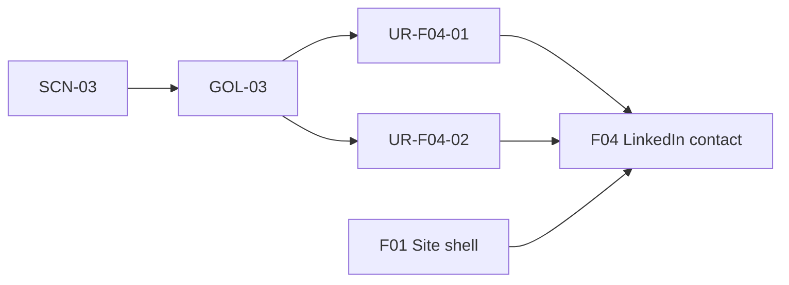
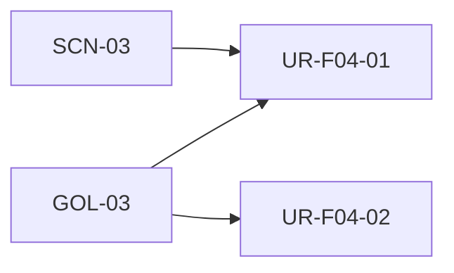
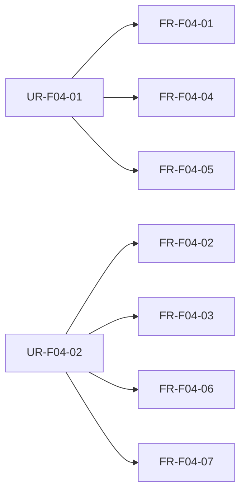
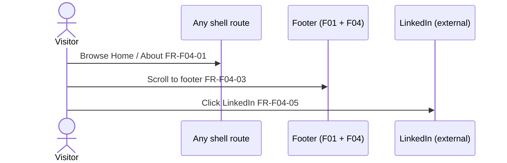
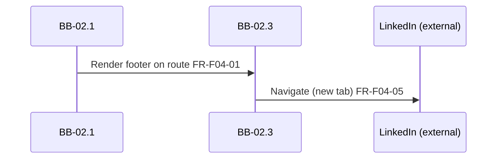

# F04: Optional LinkedIn contact

## Overview

**Intent:** Provide an understated **LinkedIn** text link inside the F01 footer frame on every shell route — inline with the copyright row — so hiring managers and interested visitors can reach the site owner without a prominent hire-me funnel or hero CTA.

**Scope:** **In:** footer LinkedIn text link (label **LinkedIn**), muted secondary styling, inline desktop layout (copyright left, link right), responsive footer stacking, new-tab external link behaviour, visibility on Home, About, and 404 routes. **Out:** footer frame structure and copyright/tagline ([F01](F01-site-shell-layout.md)); About page body and in-page LinkedIn link ([F03](F03-about-page.md)); Home/About marketing content ([F02](F02-home-page.md), [F03](F03-about-page.md)); contact forms, email links, hero CTAs, or LinkedIn icons.

**Trace:** [GOL-03](../1-scope/stakeholders-and-goals.md#gol-03-optional-contact), [SCN-03](../1-scope/business-scenarios.md#scn-03-optional-contact); [NFR-02](../3-arch/solution-strategy.md#nfr-02-accessibility), [NFR-04](../3-arch/solution-strategy.md#nfr-04-static-architecture), [NFR-05](../3-arch/solution-strategy.md#nfr-05-external-link-security)

**Blocks:** [BB-02.3 Footer Frame](../3-arch/building-blocks.md#bb-023-footer-frame) LinkedIn contact link

**Requires:** [F01 Site shell & layout](F01-site-shell-layout.md)

## Overview trace

## User requirements

| ID | Requirement | Parent |
|----|-------------|--------|
| UR-F04-01 | Hiring manager or interested visitor can find a LinkedIn link in the site footer on any page so that they may contact the site owner after reviewing Home or About | [GOL-03](../1-scope/stakeholders-and-goals.md#gol-03-optional-contact), [SCN-03](../1-scope/business-scenarios.md#scn-03-optional-contact) |
| UR-F04-02 | Visitor encounters contact as a subtle footer path so that educational content remains primary and no sales funnel dominates the experience | [GOL-03](../1-scope/stakeholders-and-goals.md#gol-03-optional-contact) |

## UR trace

## Functional requirements

| ID | Type | Requirement | Parent | Block | Acceptance |
|----|------|-------------|--------|-------|------------|
| FR-F04-01 | functional | Footer shall render a LinkedIn link on all F01 shell routes — Home, About, and 404 | UR-F04-01 | [BB-02.3](../3-arch/building-blocks.md#bb-023-footer-frame) | Given any in-scope route, when the page loads, then the footer includes a LinkedIn link |
| FR-F04-02 | functional | Link label shall be **LinkedIn** — plain text, muted/secondary styling, no icon | UR-F04-02 | [BB-02.3](../3-arch/building-blocks.md#bb-023-footer-frame) | Given any page, when the footer renders, then the link text is “LinkedIn” with subdued styling and no LinkedIn icon |
| FR-F04-03 | functional | On desktop, footer shall place copyright (and tagline if present) on the left and the LinkedIn link on the right; layout may stack on narrow viewports | UR-F04-02 | [BB-02.3](../3-arch/building-blocks.md#bb-023-footer-frame) | Given desktop width, when the footer renders, then copyright and LinkedIn appear on one row; on mobile they stack readably |
| FR-F04-04 | functional | Link href shall be [Mikhail Shumilov](https://www.linkedin.com/in/mikhail-shumilov-549a57292/) | UR-F04-01 | [BB-02.3](../3-arch/building-blocks.md#bb-023-footer-frame) | Given the footer link, when its href is inspected, then it matches the site owner LinkedIn profile URL |
| FR-F04-05 | functional | Link shall open in a new tab with `rel="noopener noreferrer"` | UR-F04-01 | [BB-02.3](../3-arch/building-blocks.md#bb-023-footer-frame) | Given the visitor clicks the footer LinkedIn link, then a new tab opens to LinkedIn and the link includes `rel="noopener noreferrer"` |
| FR-F04-06 | functional | Footer contact shall not use hero-level emphasis, hire-me banners, or contact forms | UR-F04-02 | [BB-02.3](../3-arch/building-blocks.md#bb-023-footer-frame) | Given any page, when the footer renders, then only the subtle text link appears — no button-style CTA or form |
| FR-F04-07 | functional | LinkedIn link shall render inside the F01 footer frame without altering shell header or nav | UR-F04-02 | [BB-02.3](../3-arch/building-blocks.md#bb-023-footer-frame) | Given F01 footer frame, when F04 is implemented, then the link is part of footer content and header/nav are unchanged |

## FR trace

## UI flow

1. **Hiring manager** reviews **Home** or **About** — scrolls to footer on any route (FR-F04-01).
2. **Visitor** sees **copyright row** with muted **LinkedIn** text link on the right (desktop) or stacked below (mobile) (FR-F04-02, FR-F04-03).
3. **Visitor** clicks **LinkedIn** — profile opens in a new tab (FR-F04-04, FR-F04-05).

**Not in F04:** Footer frame markup and global layout (F01); About author-section LinkedIn (F03); page body content (F02/F03); icons, forms, or hero contact CTAs.

**Mockups:** [MCK-01](../4-design/mockups.md#mck-01-site-shell) footer LinkedIn in shell frame

## UI flow diagram

## Runtime flow

1. **[BB-02.3](../3-arch/building-blocks.md#bb-023-footer-frame)** — renders footer frame with LinkedIn link alongside copyright content on every shell route (FR-F04-01, FR-F04-07).
2. **[BB-02.3](../3-arch/building-blocks.md#bb-023-footer-frame)** — static anchor to external LinkedIn URL; no API or tracking in MVP (FR-F04-04, FR-F04-05).

**Notable aspects:** External interface only — no server-side integration with LinkedIn. About page may expose a separate subtle LinkedIn link (F03); both use the same profile URL.

**See also:** [RT-02](../3-arch/runtime-views.md#rt-02-external-linkedin-contact)

## Runtime diagram

## Data model

*(none — static external link; F04 has no persistent entities)*
