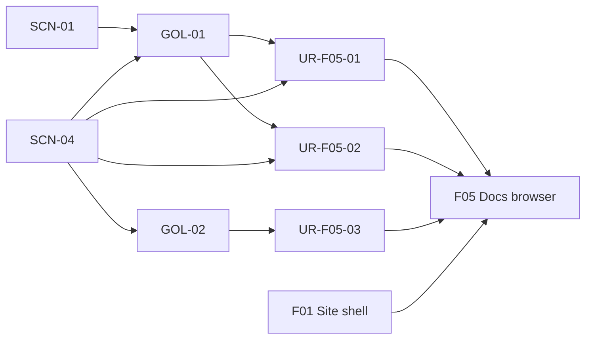
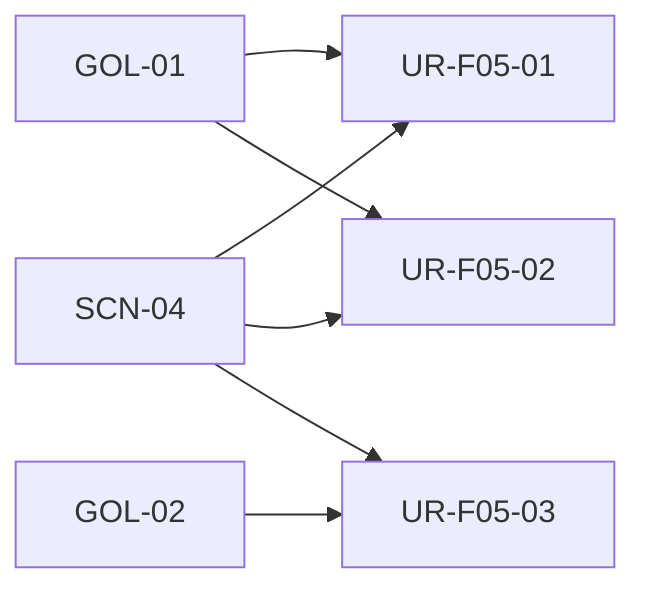
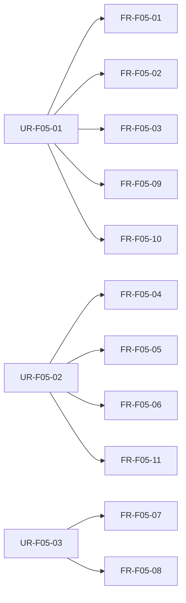
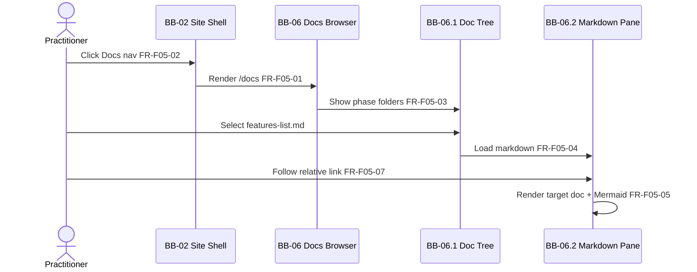
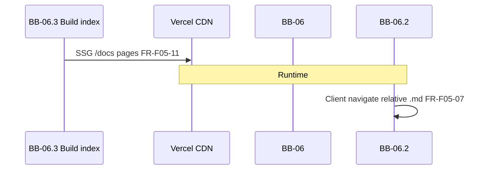

# F05: Documentation browser

## Overview

**Intent:** Deliver a dedicated **`/docs`** route inside the F01 shell where practitioners browse this product’s own documentation tree — Cursor-style **folder sidebar** plus **markdown content pane** — so they see AI Friendly Docs structure, traceability, and design artifacts rendered live (headings, tables, Mermaid, embedded SVGs).

**Scope:** **In:** `/docs` route and default landing doc; build-time index of `1-scope/`, `2-features/`, `3-arch/`, `4-design/` (incl. `mockups/screens/*.svg`), `5-dev/`; folder tree navigation; full markdown rendering; in-viewer relative `.md` link resolution; external links in new tab; **Docs** header nav item; route metadata; responsive tree collapse on mobile. **Out:** `consultation/` and `6-code/` folders; arbitrary user uploads; search; edit or comment; CMS; auth; marketing copy on Home/About ([F02](F02-home-page.md), [F03](F03-about-page.md)).

**Trace:** [GOL-01](../1-scope/stakeholders-and-goals.md#gol-01-educate-practitioners), [GOL-02](../1-scope/stakeholders-and-goals.md#gol-02-brand-credibility), [SCN-01](../1-scope/business-scenarios.md#scn-01-practitioner-discovers), [SCN-04](../1-scope/business-scenarios.md#scn-04-explore-live-docs); [NFR-01](../3-arch/solution-strategy.md#nfr-01-responsive-layout), [NFR-02](../3-arch/solution-strategy.md#nfr-02-accessibility), [NFR-03](../3-arch/solution-strategy.md#nfr-03-performance-seo), [NFR-04](../3-arch/solution-strategy.md#nfr-04-static-architecture)

**Blocks:** [BB-06 Documentation Browser](../3-arch/building-blocks.md#bb-06-documentation-browser); [BB-02.2](../3-arch/building-blocks.md#bb-022-header--navigation) nav extension; [BB-02.1](../3-arch/building-blocks.md#bb-021-root-layout--metadata) main slot host

**Requires:** [F01 Site shell & layout](F01-site-shell-layout.md)

## Overview trace

## User requirements

| ID | Requirement | Parent |
|----|-------------|--------|
| UR-F05-01 | Practitioner can open **Docs** from the site header and see a folder tree of this product’s documentation so that they understand how AI Friendly Docs artifacts are organized | [GOL-01](../1-scope/stakeholders-and-goals.md#gol-01-educate-practitioners), [SCN-01](../1-scope/business-scenarios.md#scn-01-practitioner-discovers), [SCN-04](../1-scope/business-scenarios.md#scn-04-explore-live-docs) |
| UR-F05-02 | Practitioner can select a documentation file and read fully rendered markdown (including tables, code blocks, Mermaid diagrams, and SVG images) so that they experience the methodology as a live demo | [GOL-01](../1-scope/stakeholders-and-goals.md#gol-01-educate-practitioners), [SCN-04](../1-scope/business-scenarios.md#scn-04-explore-live-docs) |
| UR-F05-03 | Practitioner can navigate between product documentation files via in-content links without leaving the docs experience so that exploration feels like an IDE file tree | [GOL-02](../1-scope/stakeholders-and-goals.md#gol-02-brand-credibility), [SCN-04](../1-scope/business-scenarios.md#scn-04-explore-live-docs) |

## UR trace

## Functional requirements

| ID | Type | Requirement | Parent | Block | Acceptance |
|----|------|-------------|--------|-------|------------|
| FR-F05-01 | functional | Docs shall render at `/docs` (and `/docs/[...path]` for deep links) inside the F01 shell main slot | UR-F05-01 | [BB-06](../3-arch/building-blocks.md#bb-06-documentation-browser), [BB-02.1](../3-arch/building-blocks.md#bb-021-root-layout--metadata) | Given the site is loaded, when the visitor opens `/docs`, then F01 shell wraps the docs layout |
| FR-F05-02 | functional | Header navigation shall expose **Home**, **About**, and **Docs** with active state on the current route | UR-F05-01 | [BB-02.2](../3-arch/building-blocks.md#bb-022-header--navigation) | Given the visitor is on `/docs`, when they view the header, then Docs is marked active |
| FR-F05-03 | functional | Docs layout shall show a **folder tree** sidebar listing `1-scope/`, `2-features/`, `3-arch/`, `4-design/`, `5-dev/` and their `.md` / `.svg` children — excluding `consultation/` and `6-code/` | UR-F05-01 | [BB-06.1](../3-arch/building-blocks.md#bb-061-doc-tree-navigation) | Given Docs loads, when the visitor views the sidebar, then all five phase folders appear with expandable children and no excluded paths |
| FR-F05-04 | functional | Selecting a `.md` file in the tree shall render its content in the main pane with headings, lists, tables, fenced code blocks, and blockquotes | UR-F05-02 | [BB-06.2](../3-arch/building-blocks.md#bb-062-markdown-content-pane) | Given Docs loads, when the visitor selects `1-scope/features-list.md`, then the pane shows rendered markdown matching repository content at build time |
| FR-F05-05 | functional | Markdown content shall render **Mermaid** fenced blocks as diagrams in the main pane | UR-F05-02 | [BB-06.2](../3-arch/building-blocks.md#bb-062-markdown-content-pane) | Given a doc contains a Mermaid code fence, when it is displayed, then a diagram renders (not raw fence text only) |
| FR-F05-06 | functional | Markdown images referencing product SVG paths (e.g. `mockups/screens/MCK-01-site-shell.svg`) shall display inline in the content pane | UR-F05-02 | [BB-06.2](../3-arch/building-blocks.md#bb-062-markdown-content-pane) | Given `4-design/mockups.md` is open, when the visitor scrolls to an SVG embed, then the image renders at readable width |
| FR-F05-07 | functional | Relative links between product `.md` files shall navigate within `/docs` and update tree selection and content pane | UR-F05-03 | [BB-06.2](../3-arch/building-blocks.md#bb-062-markdown-content-pane) | Given `features-list.md` is open, when the visitor clicks a link to `2-features/F01-site-shell-layout.md`, then the pane shows that file without a full site reload |
| FR-F05-08 | functional | External `http(s)` links in rendered docs shall open in a new tab with `rel="noopener noreferrer"` | UR-F05-03 | [BB-06.2](../3-arch/building-blocks.md#bb-062-markdown-content-pane) | Given a doc contains an external URL, when the visitor activates it, then a new tab opens with safe rel attributes |
| FR-F05-09 | functional | On viewports below the mobile breakpoint, the folder tree shall collapse behind a toggle control; the content pane remains primary | UR-F05-01 | [BB-06.1](../3-arch/building-blocks.md#bb-061-doc-tree-navigation) | Given a narrow viewport, when Docs loads, then the tree is hidden until toggled and the pane uses full width |
| FR-F05-10 | functional | Docs route shall set page title and description via the F01 metadata template | UR-F05-01 | [BB-02.1](../3-arch/building-blocks.md#bb-021-root-layout--metadata) | Given Docs loads, when metadata is inspected, then title reflects Docs using the shared template |
| FR-F05-11 | functional | Product documentation shall be ingested at **build time** from the repository — no runtime CMS or API fetch | UR-F05-02 | [BB-06.3](../3-arch/building-blocks.md#bb-063-build-time-doc-index) | Given production build, when dependencies are inspected, then doc content is static and no doc-fetch API routes exist |

## FR trace

## UI flow

1. **Practitioner** clicks **Docs** in header (or lands on `/docs`) — shell loads docs layout with sidebar and empty or default doc (FR-F05-01, FR-F05-02).
2. **Practitioner** expands a phase folder (e.g. `2-features/`) and selects `F02-home-page.md` — main pane renders markdown (FR-F05-03, FR-F05-04).
3. **Practitioner** scrolls through content — Mermaid diagrams and SVG mockups render inline (FR-F05-05, FR-F05-06).
4. **Practitioner** clicks a relative link to another `.md` file — pane and tree selection update in-viewer (FR-F05-07).
5. **Practitioner** (optional) clicks external link — new tab opens (FR-F05-08).
6. **Mobile:** Practitioner toggles tree drawer to pick another file (FR-F05-09).

**Not in F05:** Home/About marketing sections; LinkedIn contact ([F04](F04-optional-linkedin-contact.md)); editing docs; search across files; browsing `consultation/` or `6-code/`.

**Mockups:** [MCK-15](../4-design/mockups.md#mck-15-docs-browser-desktop) desktop, [MCK-16](../4-design/mockups.md#mck-16-docs-browser-mobile) mobile, [MCK-17](../4-design/mockups.md#mck-17-docs-tree-and-content) tree + content detail

## UI flow diagram

## Runtime flow

1. **[BB-06.3](../3-arch/building-blocks.md#bb-063-build-time-doc-index)** — at build, walks `1-scope/`–`5-dev/`, produces static file tree and pre-rendered or serializable markdown per path ([ADR-06](../3-arch/solution-strategy.md#adr-06-build-time-product-doc-browser), FR-F05-11).
2. **[BB-06](../3-arch/building-blocks.md#bb-06-documentation-browser)** — `/docs` and `/docs/[...path]` SSG routes resolve selected path from URL to indexed content (FR-F05-01).
3. **[BB-06.1](../3-arch/building-blocks.md#bb-061-doc-tree-navigation)** — client tree highlights current file; mobile toggle shows/hides sidebar (FR-F05-03, FR-F05-09).
4. **[BB-06.2](../3-arch/building-blocks.md#bb-062-markdown-content-pane)** — renders markdown, intercepts same-product relative links for client navigation (FR-F05-04–FR-F05-08).
5. **[BB-02.2](../3-arch/building-blocks.md#bb-022-header--navigation)** — Docs nav item with active state (FR-F05-02).

**Notable aspects:** Read-only; no server fetch after deploy. SVG assets copied or referenced from `4-design/mockups/` at build. Invalid doc paths show clear message within shell.

**See also:** [RT-04](../3-arch/runtime-views.md#rt-04-documentation-browser-journey) docs exploration journey

## Runtime diagram

## Data model

*(none — static read-only content; doc paths are URL segments, not persisted entities)*
