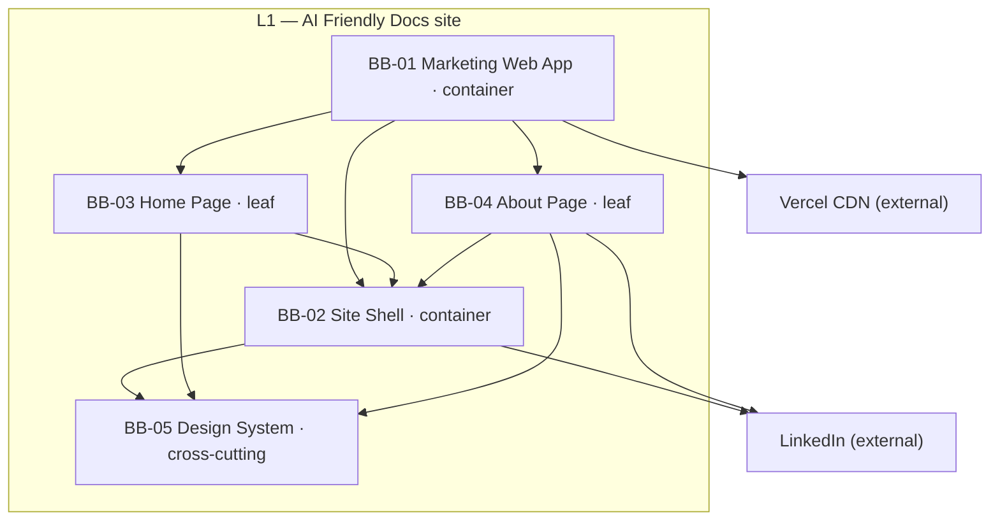
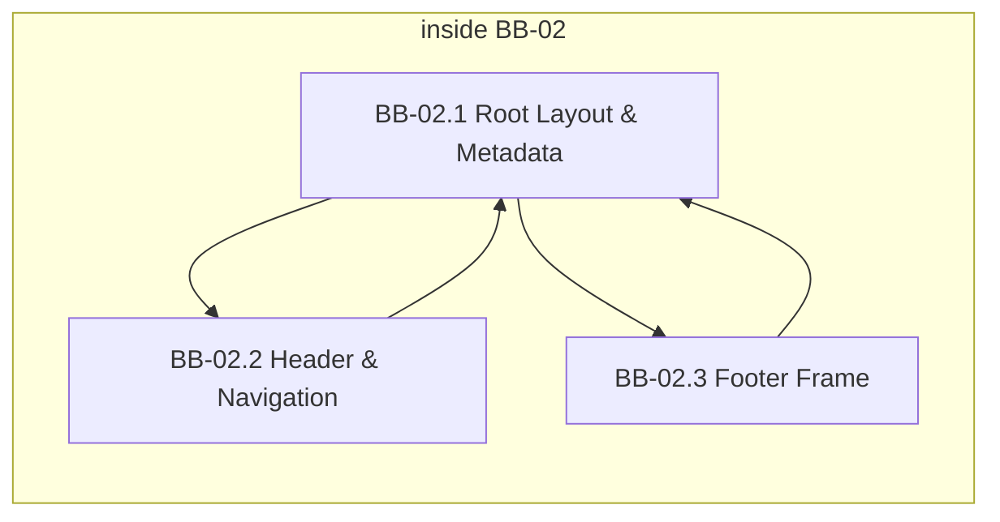

# Building Blocks

## Level 1 — Overall System

### Motivation

The MVP is a **static Next.js marketing site** (Home, About, 404) with shared shell chrome and repository-authored TSX content ([ADR-01](solution-strategy.md#adr-01-nextjs-app-router-with-ssg-on-vercel), [NFR-04](solution-strategy.md#nfr-04-static-architecture)). Decomposition separates **application hosting** (BB-01), **shared shell** (BB-02), **route page modules** (BB-03, BB-04), and **cross-cutting presentation tokens** (BB-05) so F01–F04 map to testable units without inventing backend blocks the scope excludes.

### Overview Diagram

### Building Block Summary

| ID | Level | Parent | Type | Name | Responsibility | Features |
|----|-------|--------|------|------|----------------|----------|
| BB-01 | L1 | — | container | Marketing Web Application | Next.js App Router app — SSG routes, client navigation, Vercel deploy unit | F01, F02, F03, F04 |
| BB-02 | L1 | — | container | Site Shell | Shared root layout, header/nav, footer frame, 404, metadata template | F01, F04 |
| BB-03 | L1 | — | leaf | Home Page | `/` marketing sections — hero, benefits, how-it-works, About band | F02 |
| BB-04 | L1 | — | leaf | About Page | `/about` credibility sections — methodology, site narrative, author bio | F03 |
| BB-05 | L1 | — | cross-cutting | Design System | Tailwind tokens — light corporate theme, typography, spacing, breakpoints | F01, F02, F03, F04 |

### BB-01: Marketing Web Application

**Level:** L1 · **Parent:** — · **Type:** container · **Children:** BB-02, BB-03, BB-04

**Responsibility:** Hosts the Next.js App Router application — static generation of Home, About, and not-found routes at build time; client-side route transitions for nav active state and in-page anchors. Does **not** include CMS, API routes, auth, or persistent data stores.

**Features:** [F01](../2-features/F01-site-shell-layout.md), [F02](../2-features/F02-home-page.md), [F03](../2-features/F03-about-page.md), [F04](../2-features/F04-optional-linkedin-contact.md)

**Interfaces (provided):** HTTP static pages (`/`, `/about`, 404) via Vercel CDN

**Interfaces (required):** Vercel build/deploy pipeline; BB-02 shell wraps BB-03/B04 page output

**Dependencies:** BB-02, BB-03, BB-04, BB-05

### BB-02: Site Shell

**Level:** L1 · **Parent:** — · **Type:** container · **Children:** BB-02.1, BB-02.2, BB-02.3

**Responsibility:** Shared responsive chrome on every MVP route — header brand and nav, main `{children}` slot, footer frame (copyright, tagline, optional LinkedIn), semantic landmarks, 404 within shell, shared metadata template. Does **not** own Home/About marketing copy (BB-03, BB-04).

**Features:** [F01](../2-features/F01-site-shell-layout.md), [F04](../2-features/F04-optional-linkedin-contact.md)

**Interfaces (provided):** Root layout component; `{children}` main slot for route pages; document metadata template

**Interfaces (required):** Next.js App Router layout and Metadata API; BB-05 design tokens

**Dependencies:** BB-05

### BB-03: Home Page

**Level:** L1 · **Parent:** — · **Type:** leaf

**Responsibility:** Home route (`/`) marketing content — methodology-first hero, four-card benefits grid, three-step how-it-works, soft About band, benefits anchor for in-page scroll. Static TSX-authored copy ([ADR-04](solution-strategy.md#adr-04-tsx-component-content-model)).

**Features:** [F02](../2-features/F02-home-page.md)

**Interfaces (provided):** Home page React tree rendered into BB-02 main slot

**Interfaces (required):** BB-02 root layout; BB-05 styling tokens; client anchor scroll for hero CTA

**Dependencies:** BB-02, BB-05

### BB-04: About Page

**Level:** L1 · **Parent:** — · **Type:** leaf

**Responsibility:** About route (`/about`) credibility content — page hero, methodology explanation, site-as-demo narrative, author background, subtle in-page LinkedIn link, Back to Home band. Static TSX-authored copy.

**Features:** [F03](../2-features/F03-about-page.md)

**Interfaces (provided):** About page React tree rendered into BB-02 main slot; external LinkedIn anchor in author section

**Interfaces (required):** BB-02 root layout; BB-05 styling tokens; LinkedIn profile URL (shared constant)

**Dependencies:** BB-02, BB-05

### BB-05: Design System

**Level:** L1 · **Parent:** — · **Type:** cross-cutting

**Responsibility:** Shared Tailwind configuration and utility patterns — light corporate colour palette, typography scale, spacing rhythm, responsive breakpoints (including mobile nav threshold). Ensures shell and page modules stay visually consistent ([ADR-02](solution-strategy.md#adr-02-tailwind-css-styling), [NFR-01](solution-strategy.md#nfr-01-responsive-layout)).

**Features:** [F01](../2-features/F01-site-shell-layout.md), [F02](../2-features/F02-home-page.md), [F03](../2-features/F03-about-page.md), [F04](../2-features/F04-optional-linkedin-contact.md)

**Interfaces (provided):** Tailwind theme tokens and shared component styling conventions

**Interfaces (required):** Tailwind CSS build integration in Next.js

**Dependencies:** —

## Level 2 — White Box: BB-02 Site Shell

### Overview Diagram

### Building Block Summary

| ID | Level | Parent | Type | Name | Responsibility |
|----|-------|--------|------|------|----------------|
| BB-02.1 | L2 | BB-02 | leaf | Root Layout & Metadata | Root layout wrapper, main slot, max-width column, 404 route, shared title/description template |
| BB-02.2 | L2 | BB-02 | leaf | Header & Navigation | Brand link, Home/About nav, active route state, hamburger menu on narrow viewports |
| BB-02.3 | L2 | BB-02 | leaf | Footer Frame | Copyright, methodology tagline, footer LinkedIn link (F04), responsive footer row/stack layout |

### BB-02.1: Root Layout & Metadata

**Level:** L2 · **Parent:** BB-02 · **Type:** leaf

**Responsibility:** App Router root layout — renders header, `{children}` main landmark, footer; centered ~1200px content column with full-bleed header/footer bands; `not-found` page within shell; per-route metadata via shared template ([FR-F01-01](../2-features/F01-site-shell-layout.md#fr-f01-01), [FR-F01-08](../2-features/F01-site-shell-layout.md#fr-f01-08), [FR-F01-09](../2-features/F01-site-shell-layout.md#fr-f01-09)).

**Dependencies:** BB-02.2, BB-02.3, BB-05

### BB-02.2: Header & Navigation

**Level:** L2 · **Parent:** BB-02 · **Type:** leaf

**Responsibility:** Site brand (**AI Friendly Docs** → Home), Home/About navigation with active state, hamburger collapse below mobile breakpoint ([FR-F01-02](../2-features/F01-site-shell-layout.md#fr-f01-02)–[FR-F01-04](../2-features/F01-site-shell-layout.md#fr-f01-04)).

**Dependencies:** BB-05; Next.js client router for active nav updates

### BB-02.3: Footer Frame

**Level:** L2 · **Parent:** BB-02 · **Type:** leaf

**Responsibility:** Footer band on all shell routes — copyright and optional methodology tagline (F01); muted **LinkedIn** text link with desktop left/right layout and mobile stack (F04); external link opens new tab with `rel="noopener noreferrer"` ([NFR-05](solution-strategy.md#nfr-05-external-link-security)).

**Dependencies:** BB-05; shared LinkedIn profile URL constant

## External Systems

| System | Role | Interface to | Features |
|--------|------|--------------|----------|
| Vercel | Host CDN and Next.js build/deploy pipeline for SSG pages | BB-01 | F01, F02, F03, F04 |
| LinkedIn | Site owner profile — optional contact destination | BB-02.3, BB-04 | F03, F04 |

## Deployment View

| Block | Runtime | Notes |
|-------|---------|-------|
| BB-01 | Vercel serverless/edge static assets | Pre-rendered HTML/JS at build; no runtime API or database |
| BB-02–BB-05 | Browser (React hydration for client nav, hamburger, anchor scroll) | Prefer React Server Components where possible per [ADR-01](solution-strategy.md#adr-01-nextjs-app-router-with-ssg-on-vercel) |

**Runtime flows:** [runtime-views.md](runtime-views.md)
