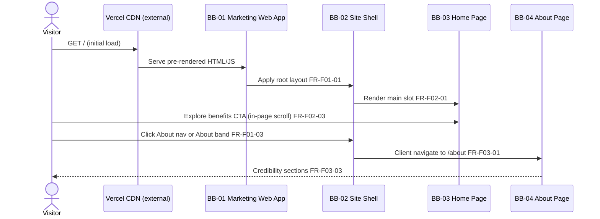
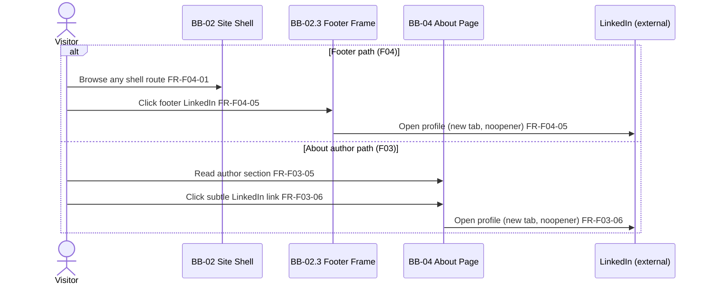
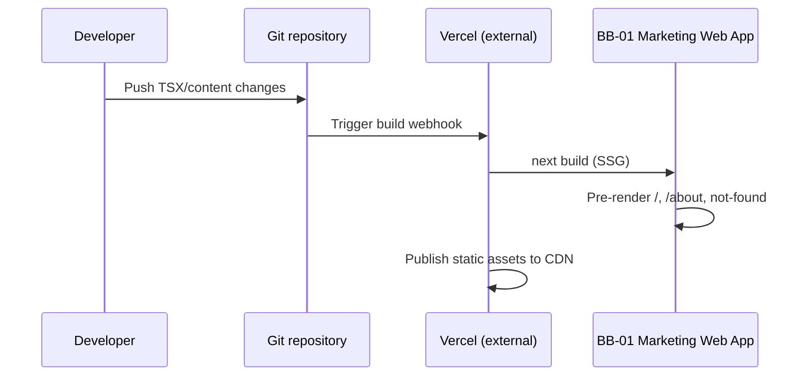

# Runtime Views

## Two-layer model

| Layer | File |
|-------|------|
| Feature | `F##_*.md` → **Runtime flow** (happy path + feature-local behaviour) |
| Architecture | `runtime-views.md` → `RT-##` (cross-feature, external, operational) |

## What belongs here

**Include:** flows crossing 2+ blocks; external interfaces; build/deploy ops; shared security patterns.

**Exclude:** screen layout → feature **UI flow**; static block inventory → [building-blocks.md](building-blocks.md); field-level data (none in MVP).

Per-feature route rendering, in-page scroll, and single-block nav updates stay in [F01](../2-features/F01-site-shell-layout.md), [F02](../2-features/F02-home-page.md), [F03](../2-features/F03-about-page.md), and [F04](../2-features/F04-optional-linkedin-contact.md) **Runtime flow** sections.

## Scenario Index

| ID | Name | Category | Trigger | Features | Blocks | Notation |
|----|------|----------|---------|----------|--------|----------|
| RT-01 | Practitioner cross-route journey | Use case | Visitor lands on `/` | F01, F02, F03 | BB-01, BB-02, BB-03, BB-04 | sequence |
| RT-02 | External LinkedIn contact | External interface | Visitor clicks LinkedIn link | F03, F04 | BB-02.3, BB-04, LinkedIn (external) | sequence |
| RT-03 | Static build and deploy | Operational | Git push or manual Vercel deploy | F01, F02, F03, F04 | BB-01, Vercel (external) | sequence |

## Use case scenarios

### RT-01: Practitioner cross-route journey {#rt-01-practitioner-cross-route-journey}

**Category:** Use case · **Trigger:** Practitioner arrives at Home via search, referral, or direct URL ([SCN-01](../1-scope/business-scenarios.md#scn-01-practitioner-discovers))

**Building blocks:** [BB-01](building-blocks.md#bb-01-marketing-web-application), [BB-02](building-blocks.md#bb-02-site-shell), [BB-03](building-blocks.md#bb-03-home-page), [BB-04](building-blocks.md#bb-04-about-page)

**Features:** [F01](../2-features/F01-site-shell-layout.md), [F02](../2-features/F02-home-page.md), [F03](../2-features/F03-about-page.md) · **Traces to:** [SCN-01](../1-scope/business-scenarios.md#scn-01-practitioner-discovers), [SCN-02](../1-scope/business-scenarios.md#scn-02-evaluate-benefits), [FR-F02-07](../2-features/F02-home-page.md#fr-f02-07), [FR-F01-03](../2-features/F01-site-shell-layout.md#fr-f01-03)

#### Scenario

#### Notable aspects

- **Data:** No server fetch — all content shipped at build time ([NFR-04](solution-strategy.md#nfr-04-static-architecture)).
- **Navigation:** Client router updates active nav in BB-02.2 without full shell remount.
- **Failure:** Invalid paths handled by BB-02.1 not-found route (see F01 **Runtime flow**).

#### Alternate / error paths

| Condition | Behaviour | Blocks |
|-----------|-----------|--------|
| Visitor leaves after Home only | Partial SCN-01 goal — awareness achieved; no server-side event | BB-03 |
| Unknown URL | 404 page within shell | BB-02.1 |

## External interface scenarios

### RT-02: External LinkedIn contact {#rt-02-external-linkedin-contact}

**Category:** External interface · **Trigger:** Hiring manager or visitor clicks a LinkedIn anchor after reviewing Home or About ([SCN-03](../1-scope/business-scenarios.md#scn-03-optional-contact))

**Building blocks:** [BB-02.3](building-blocks.md#bb-023-footer-frame), [BB-04](building-blocks.md#bb-04-about-page), LinkedIn (external)

**Features:** [F03](../2-features/F03-about-page.md), [F04](../2-features/F04-optional-linkedin-contact.md) · **Traces to:** [FR-F03-06](../2-features/F03-about-page.md#fr-f03-06), [FR-F04-05](../2-features/F04-optional-linkedin-contact.md#fr-f04-05), [NFR-05](solution-strategy.md#nfr-05-external-link-security)

#### Scenario

#### Notable aspects

- **Security:** All external profile links use `target="_blank"` and `rel="noopener noreferrer"` ([NFR-05](solution-strategy.md#nfr-05-external-link-security)).
- **Integration:** No LinkedIn API — static `href` to configured profile URL; same constant for F03 and F04.
- **Failure:** LinkedIn unavailable → browser error in new tab; no in-app fallback (acceptable per scope).

## Operational scenarios

### RT-03: Static build and deploy {#rt-03-static-build-and-deploy}

**Category:** Operational · **Trigger:** Repository change merged and Vercel build runs ([ADR-01](solution-strategy.md#adr-01-nextjs-app-router-with-ssg-on-vercel))

**Building blocks:** [BB-01](building-blocks.md#bb-01-marketing-web-application), Vercel (external)

**Features:** F01, F02, F03, F04

#### Scenario

#### Notable aspects

- **Content model:** Marketing copy in TSX components ([ADR-04](solution-strategy.md#adr-04-tsx-component-content-model)) — copy edits require rebuild.
- **Quality gate:** Pre-deploy Lighthouse and Playwright checks per [NFR-03](solution-strategy.md#nfr-03-performance-seo), [ADR-05](solution-strategy.md#adr-05-playwright-and-vitest-testing).

## Error and degradation patterns

| Pattern | Trigger | Behaviour | RT-## | Blocks |
|---------|---------|-----------|-------|--------|
| Unknown route | Invalid path requested | BB-02.1 renders 404 within shell | — (F01) | BB-02.1 |
| External profile unavailable | LinkedIn down or URL changed | New tab fails; verify URL in E2E tests | RT-02 | BB-02.3, BB-04 |
| Build failure | Type or lint error in CI | Deploy blocked; prior CDN version remains live | RT-03 | BB-01 |

## Notation reference

| Shape | Prefer |
|-------|--------|
| API / interaction chain | `sequenceDiagram` |
| Branching user paths | `flowchart TD` |
| Lifecycle / state | `stateDiagram-v2` |

**Static ↔ runtime:** new participant → update [building-blocks.md](building-blocks.md) first.
