# Mockups

SVG rules: [08-design-mockups](../.cursor/rules/08-design-mockups.mdc). Design tokens: [library.md](library.md). Components: [design-strategy.md](design-strategy.md#component-inventory).

| ID | Screen | File | Feature(s) | Journey | Route | Status |
|----|--------|------|------------|---------|-------|--------|
| MCK-01 | Site shell (header + footer) | [MCK-01-site-shell.svg](mockups/screens/MCK-01-site-shell.svg) | F01, F04 | JRN-01, JRN-03 | `*` | Draft |
| MCK-02 | Mobile nav overlay | [MCK-02-mobile-nav.svg](mockups/screens/MCK-02-mobile-nav.svg) | F01 | JRN-01 | `*` | Draft |
| MCK-03 | Home — hero section | [MCK-03-home-hero.svg](mockups/screens/MCK-03-home-hero.svg) | F02 | JRN-01 | `/` | Draft |
| MCK-04 | Home — benefits grid | [MCK-04-home-benefits.svg](mockups/screens/MCK-04-home-benefits.svg) | F02 | JRN-01, JRN-02 | `/` | Draft |
| MCK-05 | Home — how it works | [MCK-05-home-how-it-works.svg](mockups/screens/MCK-05-home-how-it-works.svg) | F02 | JRN-01, JRN-02 | `/` | Draft |
| MCK-06 | Home — full page (desktop) | [MCK-06-home-full-desktop.svg](mockups/screens/MCK-06-home-full-desktop.svg) | F02 | JRN-01, JRN-02, JRN-03 | `/` | Draft |
| MCK-07 | Home — full page (mobile) | [MCK-07-home-full-mobile.svg](mockups/screens/MCK-07-home-full-mobile.svg) | F02 | JRN-01 | `/` | Draft |
| MCK-08 | About — page hero | [MCK-08-about-hero.svg](mockups/screens/MCK-08-about-hero.svg) | F03 | JRN-02 | `/about` | Draft |
| MCK-09 | About — methodology section | [MCK-09-about-methodology.svg](mockups/screens/MCK-09-about-methodology.svg) | F03 | JRN-01 | `/about` | Draft |
| MCK-10 | About — site narrative | [MCK-10-about-site-narrative.svg](mockups/screens/MCK-10-about-site-narrative.svg) | F03 | JRN-01, JRN-02 | `/about` | Draft |
| MCK-11 | About — author section | [MCK-11-about-author.svg](mockups/screens/MCK-11-about-author.svg) | F03 | JRN-01, JRN-02, JRN-03 | `/about` | Draft |
| MCK-12 | About — full page (desktop) | [MCK-12-about-full-desktop.svg](mockups/screens/MCK-12-about-full-desktop.svg) | F03 | JRN-01, JRN-02, JRN-03 | `/about` | Draft |
| MCK-13 | About — full page (mobile) | [MCK-13-about-full-mobile.svg](mockups/screens/MCK-13-about-full-mobile.svg) | F03 | JRN-02 | `/about` | Draft |
| MCK-14 | 404 not found | [MCK-14-not-found.svg](mockups/screens/MCK-14-not-found.svg) | F01 | — | `*` | Draft |
| MCK-15 | Docs — full page (desktop) | — | F05 | JRN-04 | `/docs` | Planned |
| MCK-16 | Docs — full page (mobile) | — | F05 | JRN-04 | `/docs` | Planned |
| MCK-17 | Docs — tree + content pane | — | F05 | JRN-04 | `/docs` | Planned |

## MCK-01: Site shell (header + footer) {#mck-01-site-shell}

**Feature:** [F01-site-shell-layout](../2-features/F01-site-shell-layout.md) · **FR:** [FR-F01-01](../2-features/F01-site-shell-layout.md#fr-f01-01), [FR-F01-02](../2-features/F01-site-shell-layout.md#fr-f01-02), [FR-F01-06](../2-features/F01-site-shell-layout.md#fr-f01-06), [FR-F01-07](../2-features/F01-site-shell-layout.md#fr-f01-07) · **Components:** [CMP-01](design-strategy.md#cmp-01-site-header), [CMP-03](design-strategy.md#cmp-03-footer-frame), [CMP-08](design-strategy.md#cmp-08-external-link)

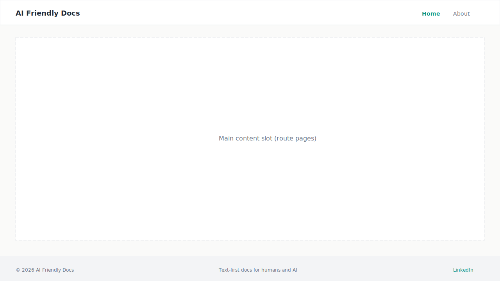

**Layout (planned):**

- Full-bleed white header band: **AI Friendly Docs** brand left; Home and About nav links right (desktop)
- Centred main slot (~1200px max-width) — empty placeholder for route content
- Full-bleed footer band: copyright left, methodology tagline centre, understated LinkedIn text link right (F04)

## MCK-02: Mobile nav overlay {#mck-02-mobile-nav}

**Feature:** [F01-site-shell-layout](../2-features/F01-site-shell-layout.md) · **FR:** [FR-F01-04](../2-features/F01-site-shell-layout.md#fr-f01-04) · **Components:** [CMP-02](design-strategy.md#cmp-02-mobile-nav-drawer)

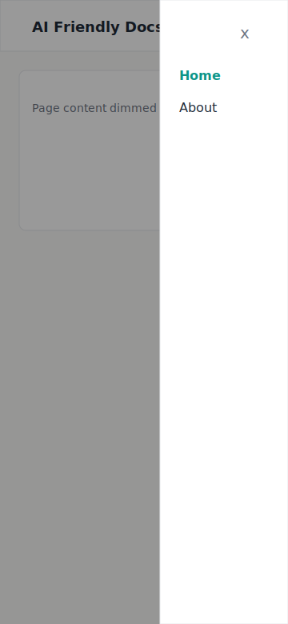

**Layout (planned):**

- Narrow viewport (360px); hamburger icon in header replaces inline nav
- Open state: semi-transparent scrim over page; white drawer panel with stacked Home / About links
- Close via hamburger or scrim tap; keyboard focus trapped while open

## MCK-03: Home — hero section {#mck-03-home-hero}

**Feature:** [F02-home-page](../2-features/F02-home-page.md) · **FR:** [FR-F02-02](../2-features/F02-home-page.md#fr-f02-02), [FR-F02-03](../2-features/F02-home-page.md#fr-f02-03) · **Components:** [CMP-04](design-strategy.md#cmp-04-primary-button), [CMP-06](design-strategy.md#cmp-06-section-heading)

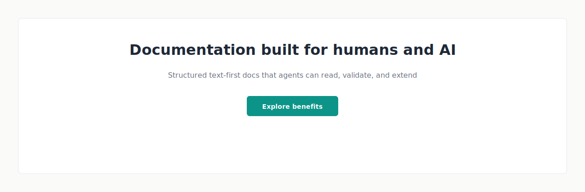

**Layout (planned):**

- Centered stack pattern on elevated white band over surface background
- Methodology-first H1 headline; subhead on structured text-first docs for humans and AI agents
- Single **Explore benefits** primary CTA (teal); no contact or LinkedIn in hero
- Mobile: headline and subhead stack; CTA full-width below text

## MCK-04: Home — benefits grid {#mck-04-home-benefits}

**Feature:** [F02-home-page](../2-features/F02-home-page.md) · **FR:** [FR-F02-04](../2-features/F02-home-page.md#fr-f02-04), [FR-F02-05](../2-features/F02-home-page.md#fr-f02-05), [FR-F02-09](../2-features/F02-home-page.md#fr-f02-09) · **Components:** [CMP-05](design-strategy.md#cmp-05-benefit-card), [CMP-06](design-strategy.md#cmp-06-section-heading)

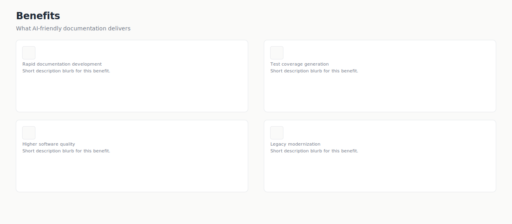

**Layout (planned):**

- Section id anchor for in-page scroll from hero CTA
- H2 **Benefits** with optional intro line
- 2×2 card grid on desktop: rapid docs, test coverage, quality, legacy modernization — icon placeholder, title, 2–3 sentence blurb each
- Mobile: cards stack single column with consistent gap

## MCK-05: Home — how it works {#mck-05-home-how-it-works}

**Feature:** [F02-home-page](../2-features/F02-home-page.md) · **FR:** [FR-F02-06](../2-features/F02-home-page.md#fr-f02-06) · **Components:** [CMP-06](design-strategy.md#cmp-06-section-heading)

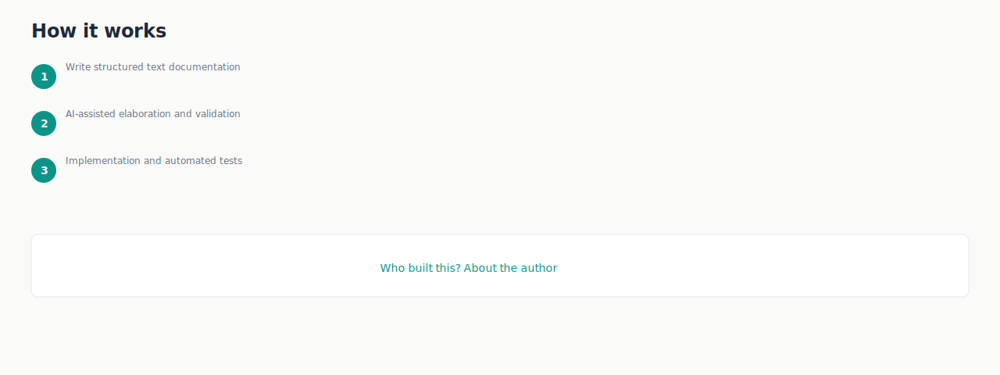

**Layout (planned):**

- H2 **How it works** section
- Three numbered steps in vertical list: (1) structured text docs, (2) AI-assisted elaboration and validation, (3) implementation and tests
- Soft About credibility band below: **Who built this?** text link to `/about` (FR-F02-07)

## MCK-06: Home — full page (desktop) {#mck-06-home-full-desktop}

**Feature:** [F02-home-page](../2-features/F02-home-page.md) · **FR:** [FR-F02-01](../2-features/F02-home-page.md#fr-f02-01) · **Components:** [CMP-01](design-strategy.md#cmp-01-site-header), [CMP-03](design-strategy.md#cmp-03-footer-frame), [CMP-04](design-strategy.md#cmp-04-primary-button), [CMP-05](design-strategy.md#cmp-05-benefit-card), [CMP-07](design-strategy.md#cmp-07-text-link)

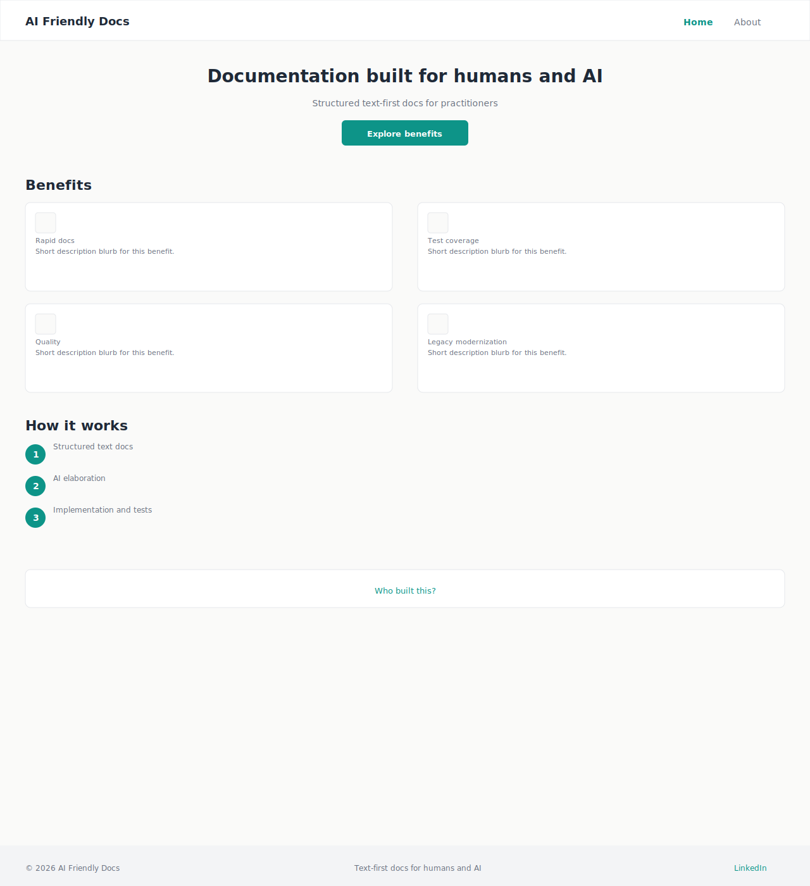

**Layout (planned):**

- Composes MCK-01 shell with MCK-03 hero, MCK-04 benefits, MCK-05 how-it-works, and About band in one scrollable desktop view
- Active nav: Home highlighted in teal

## MCK-07: Home — full page (mobile) {#mck-07-home-full-mobile}

**Feature:** [F02-home-page](../2-features/F02-home-page.md) · **FR:** [FR-F02-01](../2-features/F02-home-page.md#fr-f02-01), [FR-F02-04](../2-features/F02-home-page.md#fr-f02-04) · **Components:** [CMP-01](design-strategy.md#cmp-01-site-header), [CMP-03](design-strategy.md#cmp-03-footer-frame)

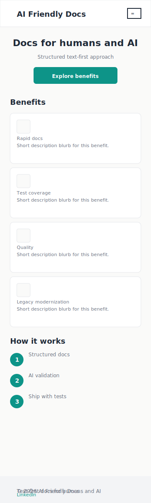

**Layout (planned):**

- 360px frame; hamburger in header; all sections stacked single column
- Benefits cards full width; footer tagline may wrap to two lines

## MCK-08: About — page hero {#mck-08-about-hero}

**Feature:** [F03-about-page](../2-features/F03-about-page.md) · **FR:** [FR-F03-02](../2-features/F03-about-page.md#fr-f03-02) · **Components:** [CMP-06](design-strategy.md#cmp-06-section-heading)

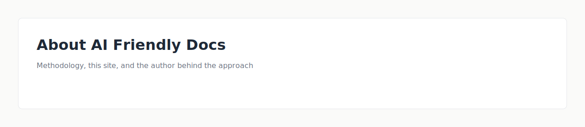

**Layout (planned):**

- Distinct page hero: H1 **About AI Friendly Docs** with one-line intro below
- Linear scroll pattern begins here; no sidebar nav

## MCK-09: About — methodology section {#mck-09-about-methodology}

**Feature:** [F03-about-page](../2-features/F03-about-page.md) · **FR:** [FR-F03-03](../2-features/F03-about-page.md#fr-f03-03) · **Components:** [CMP-06](design-strategy.md#cmp-06-section-heading)

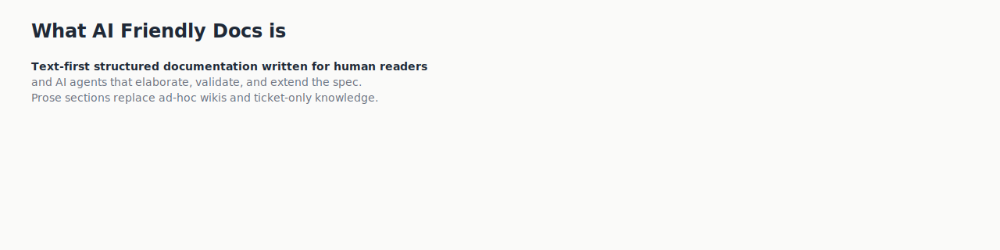

**Layout (planned):**

- H2 **What AI Friendly Docs is**
- Prose paragraph(s) on text-first structured documentation for humans and AI agents
- Does not duplicate Home benefits grid

## MCK-10: About — site narrative {#mck-10-about-site-narrative}

**Feature:** [F03-about-page](../2-features/F03-about-page.md) · **FR:** [FR-F03-04](../2-features/F03-about-page.md#fr-f03-04) · **Components:** [CMP-06](design-strategy.md#cmp-06-section-heading)

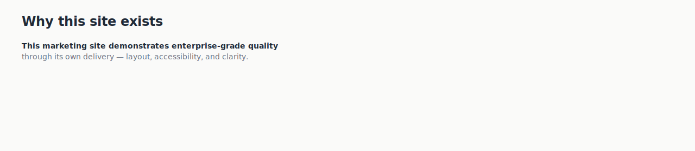

**Layout (planned):**

- H2 **Why this site exists**
- Prose explaining the site as a quality demonstration of the documentation approach (GOL-02)

## MCK-11: About — author section {#mck-11-about-author}

**Feature:** [F03-about-page](../2-features/F03-about-page.md) · **FR:** [FR-F03-05](../2-features/F03-about-page.md#fr-f03-05), [FR-F03-06](../2-features/F03-about-page.md#fr-f03-06) · **Components:** [CMP-06](design-strategy.md#cmp-06-section-heading), [CMP-08](design-strategy.md#cmp-08-external-link)

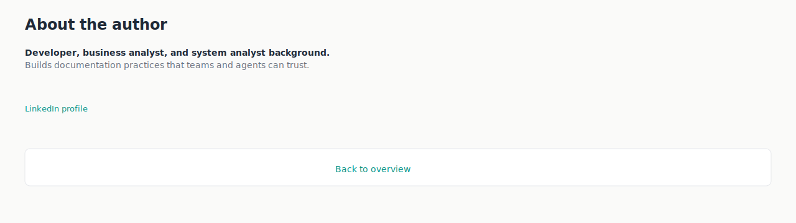

**Layout (planned):**

- H2 **About the author**
- Text-only bio: developer, business analyst, system analyst roles — no photo in MVP
- Subtle inline LinkedIn text link at end of bio (low emphasis, not a banner)
- **Back to overview** text link band below section (FR-F03-07)

## MCK-12: About — full page (desktop) {#mck-12-about-full-desktop}

**Feature:** [F03-about-page](../2-features/F03-about-page.md) · **FR:** [FR-F03-01](../2-features/F03-about-page.md#fr-f03-01), [FR-F03-09](../2-features/F03-about-page.md#fr-f03-09) · **Components:** [CMP-01](design-strategy.md#cmp-01-site-header), [CMP-03](design-strategy.md#cmp-03-footer-frame), [CMP-07](design-strategy.md#cmp-07-text-link), [CMP-08](design-strategy.md#cmp-08-external-link)

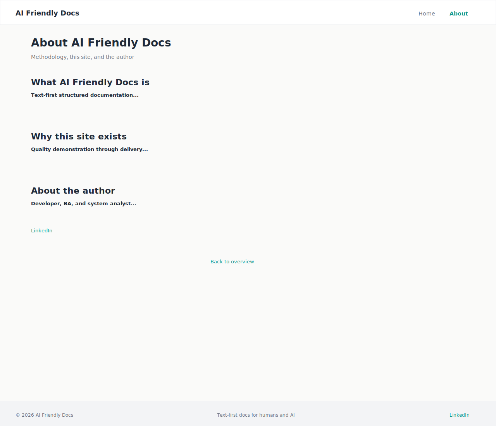

**Layout (planned):**

- Composes shell with MCK-08 through MCK-11 sections in order: hero → methodology → site narrative → author → back link
- Active nav: About highlighted in teal

## MCK-13: About — full page (mobile) {#mck-13-about-full-mobile}

**Feature:** [F03-about-page](../2-features/F03-about-page.md) · **FR:** [FR-F03-01](../2-features/F03-about-page.md#fr-f03-01) · **Components:** [CMP-01](design-strategy.md#cmp-01-site-header), [CMP-03](design-strategy.md#cmp-03-footer-frame)

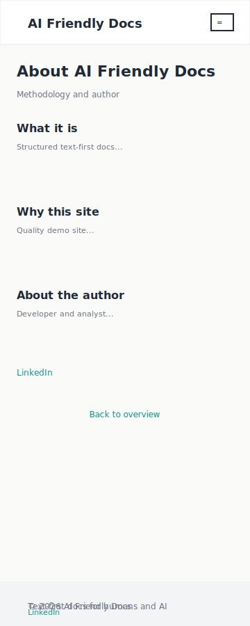

**Layout (planned):**

- 360px frame; linear sections stack with section spacing tokens
- LinkedIn link and back link remain text-only, understated

## MCK-14: 404 not found {#mck-14-not-found}

**Feature:** [F01-site-shell-layout](../2-features/F01-site-shell-layout.md) · **FR:** [FR-F01-08](../2-features/F01-site-shell-layout.md#fr-f01-08) · **Components:** [CMP-01](design-strategy.md#cmp-01-site-header), [CMP-03](design-strategy.md#cmp-03-footer-frame), [CMP-07](design-strategy.md#cmp-07-text-link)

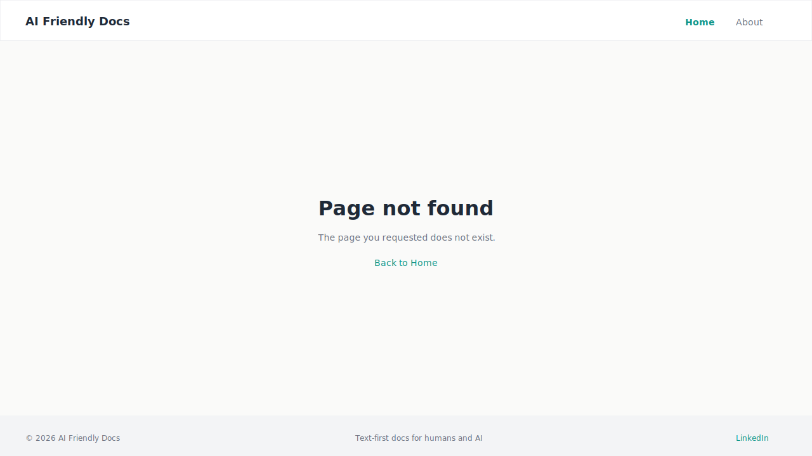

**Layout (planned):**

- Same shell as MCK-01; main slot shows centred **Page not found** message and link back to Home
- No stack trace or technical error detail

## MCK-15: Docs — full page (desktop) {#mck-15-docs-browser-desktop}

**Feature:** [F05-documentation-browser](../2-features/F05-documentation-browser.md) · **FR:** [FR-F05-01](../2-features/F05-documentation-browser.md#fr-f05-01)–[FR-F05-03](../2-features/F05-documentation-browser.md#fr-f05-03) · **Components:** [CMP-01](design-strategy.md#cmp-01-site-header), [CMP-09](design-strategy.md#cmp-09-doc-tree-sidebar), [CMP-10](design-strategy.md#cmp-10-markdown-content-pane)

**Layout (planned):**

- Standard site shell with **Docs** nav active
- Split layout below header: left doc tree (~260px), right markdown pane with rendered `features-list.md` or similar
- Footer band unchanged from MCK-01

*SVG deferred — layout spec authoritative until asset created.*

## MCK-16: Docs — full page (mobile) {#mck-16-docs-browser-mobile}

**Feature:** [F05-documentation-browser](../2-features/F05-documentation-browser.md) · **FR:** [FR-F05-09](../2-features/F05-documentation-browser.md#fr-f05-09) · **Components:** [CMP-02](design-strategy.md#cmp-02-mobile-nav-drawer), [CMP-09](design-strategy.md#cmp-09-doc-tree-sidebar), [CMP-10](design-strategy.md#cmp-10-markdown-content-pane)

**Layout (planned):**

- Narrow viewport (360px); hamburger for site nav; separate **Browse files** toggle for doc tree drawer
- Content pane full width when tree closed
- Markdown prose reflows; tables scroll horizontally if needed

*SVG deferred.*

## MCK-17: Docs — tree + content pane {#mck-17-docs-tree-and-content}

**Feature:** [F05-documentation-browser](../2-features/F05-documentation-browser.md) · **FR:** [FR-F05-04](../2-features/F05-documentation-browser.md#fr-f05-04)–[FR-F05-07](../2-features/F05-documentation-browser.md#fr-f05-07) · **Components:** [CMP-09](design-strategy.md#cmp-09-doc-tree-sidebar), [CMP-10](design-strategy.md#cmp-10-markdown-content-pane)

**Layout (planned):**

- Expanded tree showing `4-design/` with `mockups.md` selected
- Content pane: rendered heading, table, Mermaid diagram block, and inline SVG mockup image
- Relative link to another `.md` file styled as teal prose link

*SVG deferred.*
