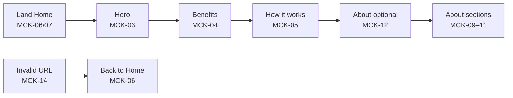
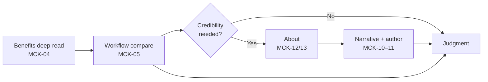
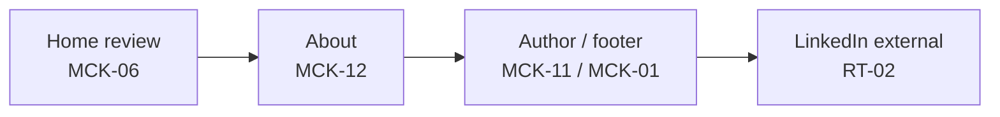
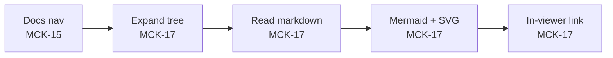

# User Journeys

End-to-end paths derived from [business scenarios](../1-scope/business-scenarios.md). Screen references: [mockups.md](mockups.md). Cross-block behaviour: [runtime-views.md](../3-arch/runtime-views.md).

## JRN-01: Practitioner discovers the methodology {#jrn-01-practitioner-discovers}

**Persona:** Practitioner visitor (developer, BA, or PM) · **Goal:** Quickly understand what AI-friendly documentation is and why it matters · **Scenario:** [SCN-01](../1-scope/business-scenarios.md#scn-01-practitioner-discovers) · **Runtime:** [RT-01](../3-arch/runtime-views.md#rt-01-practitioner-cross-route-journey) · **Features:** F01, F02, F03

### Steps

| Step | Action | Feature | UI state |
|------|--------|---------|----------|
| 1 | Arrive at Home via search, referral, or direct URL — site shell loads with header and footer | F01, F02 | [MCK-06](mockups.md#mck-06-home-full-desktop) (desktop) / [MCK-07](mockups.md#mck-07-home-full-mobile) (mobile) |
| 2 | Read methodology-first hero headline and subhead | F02 | [MCK-03](mockups.md#mck-03-home-hero) |
| 3 | Activate **Explore benefits** — in-page scroll to benefits anchor | F02 | [MCK-03](mockups.md#mck-03-home-hero) → [MCK-04](mockups.md#mck-04-home-benefits) |
| 4 | Scan four benefit cards (rapid docs, test coverage, quality, legacy modernization) | F02 | [MCK-04](mockups.md#mck-04-home-benefits) |
| 5 | Read **How it works** — structured docs → AI elaboration → implementation and tests | F02 | [MCK-05](mockups.md#mck-05-home-how-it-works) |
| 6 | *(Optional)* Follow **Who built this?** band to About | F02, F03 | [MCK-05](mockups.md#mck-05-home-how-it-works) → [MCK-12](mockups.md#mck-12-about-full-desktop) |
| 7 | *(Optional)* Read About sections — methodology, site purpose, author background | F03 | [MCK-09](mockups.md#mck-09-about-methodology), [MCK-10](mockups.md#mck-10-about-site-narrative), [MCK-11](mockups.md#mck-11-about-author) |

### Alternate flows

| Branch | When | Outcome | UI state |
|--------|------|---------|----------|
| Home only | Visitor leaves after step 5 | Partial SCN-01 — awareness achieved | [MCK-06](mockups.md#mck-06-home-full-desktop) |
| Header nav to About | Visitor uses global About link instead of About band | Same as steps 6–7 via [RT-01](../3-arch/runtime-views.md#rt-01-practitioner-cross-route-journey) | [MCK-01](mockups.md#mck-01-site-shell) → [MCK-12](mockups.md#mck-12-about-full-desktop) |
| Mobile nav | Narrow viewport — open hamburger, select route | Shell nav per [FR-F01-04](../2-features/F01-site-shell-layout.md#fr-f01-04) | [MCK-02](mockups.md#mck-02-mobile-nav) |
| Unknown URL | Visitor opens invalid path (typo, stale bookmark, mistyped URL) | Not-found message inside shell; visitor may return to Home via **Back to Home** link per [FR-F01-08](../2-features/F01-site-shell-layout.md#fr-f01-08) | [MCK-14](mockups.md#mck-14-not-found) → [MCK-06](mockups.md#mck-06-home-full-desktop) |

### Visual flow

Journey storyboard SVG: — *(deferred; step table and mockup links are authoritative for MVP)*

---

## JRN-02: Practitioner evaluates team applicability {#jrn-02-evaluate-benefits}

**Persona:** Practitioner visitor · **Goal:** Decide whether AI-friendly documentation practices are worth adopting for their team or project · **Scenario:** [SCN-02](../1-scope/business-scenarios.md#scn-02-evaluate-benefits) · **Runtime:** [RT-01](../3-arch/runtime-views.md#rt-01-practitioner-cross-route-journey) · **Features:** F01, F02, F03

### Steps

| Step | Action | Feature | UI state |
|------|--------|---------|----------|
| 1 | On Home — re-read or deep-dive benefit sections (quality, test coverage, legacy refactoring) | F02 | [MCK-04](mockups.md#mck-04-home-benefits) |
| 2 | Compare three-step workflow to current documentation pain points | F02 | [MCK-05](mockups.md#mck-05-home-how-it-works) |
| 3 | *(Alternate)* Navigate to About before forming judgment — assess author credibility | F01, F03 | [MCK-12](mockups.md#mck-12-about-full-desktop) / [MCK-13](mockups.md#mck-13-about-full-mobile) |
| 4 | Read **Why this site exists** and **About the author** for credibility signals | F03 | [MCK-10](mockups.md#mck-10-about-site-narrative), [MCK-11](mockups.md#mck-11-about-author) |
| 5 | Form judgment — adopt, explore further offline, or dismiss | — | — |

### Alternate flows

| Branch | When | Outcome | UI state |
|--------|------|---------|----------|
| Credibility first | Visitor opens About from header before re-reading benefits | Steps 3–4 before 1–2 | [MCK-01](mockups.md#mck-01-site-shell) → [MCK-08](mockups.md#mck-08-about-hero) |
| Home-only judgment | Visitor decides from benefits and how-it-works without About | Steps 1–2, then 5 | [MCK-06](mockups.md#mck-06-home-full-desktop) |

### Visual flow

Journey storyboard SVG: —

---

## JRN-03: Hiring manager optional contact {#jrn-03-optional-contact}

**Persona:** Hiring manager visitor · **Goal:** Reach the site owner via LinkedIn without a dedicated sales funnel · **Scenario:** [SCN-03](../1-scope/business-scenarios.md#scn-03-optional-contact) · **Runtime:** [RT-02](../3-arch/runtime-views.md#rt-02-external-linkedin-contact) · **Features:** F02, F03, F04

### Steps

| Step | Action | Feature | UI state |
|------|--------|---------|----------|
| 1 | Review Home for evidence of professional delivery capability | F02 | [MCK-06](mockups.md#mck-06-home-full-desktop) |
| 2 | Open About — read credibility and author sections | F03 | [MCK-12](mockups.md#mck-12-about-full-desktop) |
| 3 | Locate understated LinkedIn link in author section or footer | F03, F04 | [MCK-11](mockups.md#mck-11-about-author), [MCK-01](mockups.md#mck-01-site-shell) |
| 4 | Open LinkedIn profile in new tab (`noopener noreferrer`) | F03, F04 | — *(external — [RT-02](../3-arch/runtime-views.md#rt-02-external-linkedin-contact))* |

### Alternate flows

| Branch | When | Outcome | UI state |
|--------|------|---------|----------|
| Skip contact | Visitor does not click LinkedIn | SCN-03 goal not met; no other in-site contact path | — |
| Footer only | Visitor finds LinkedIn in footer without visiting About | Step 3 via footer on any route | [MCK-01](mockups.md#mck-01-site-shell) |

### Visual flow

Journey storyboard SVG: —

---

## JRN-04: Practitioner explores live documentation {#jrn-04-explore-live-docs}

**Persona:** Practitioner visitor · **Goal:** Browse this product’s documentation tree with rendered markdown to see AI Friendly Docs in practice · **Scenario:** [SCN-04](../1-scope/business-scenarios.md#scn-04-explore-live-docs) · **Runtime:** [RT-04](../3-arch/runtime-views.md#rt-04-documentation-browser-journey) · **Features:** F01, F05

### Steps

| Step | Action | Feature | UI state |
|------|--------|---------|----------|
| 1 | Click **Docs** in header (or land on `/docs`) | F01, F05 | [MCK-15](mockups.md#mck-15-docs-browser-desktop) |
| 2 | Expand phase folder (e.g. `2-features/`) in sidebar tree | F05 | [MCK-17](mockups.md#mck-17-docs-tree-and-content) |
| 3 | Select a `.md` file — read rendered headings, tables, and prose | F05 | [MCK-17](mockups.md#mck-17-docs-tree-and-content) |
| 4 | View Mermaid diagram and embedded SVG mockup in content | F05 | [MCK-17](mockups.md#mck-17-docs-tree-and-content) |
| 5 | Follow relative link to another product `.md` file — pane updates in-viewer | F05 | [MCK-17](mockups.md#mck-17-docs-tree-and-content) |

### Alternate flows

| Branch | When | Outcome | UI state |
|--------|------|---------|----------|
| Mobile tree | Narrow viewport | Toggle tree drawer before file pick | [MCK-16](mockups.md#mck-16-docs-browser-mobile) |
| Single file only | Visitor reads one doc and leaves | Partial SCN-04 — single-artifact awareness | [MCK-15](mockups.md#mck-15-docs-browser-desktop) |
| From SCN-01 | Visitor opens Docs after Home without About | Cross-route via header nav | [MCK-06](mockups.md#mck-06-home-full-desktop) → [MCK-15](mockups.md#mck-15-docs-browser-desktop) |

### Visual flow

Journey storyboard SVG: —

---

## Coverage

| Scenario | Journey | Must UI flow steps covered |
|----------|---------|---------------------------|
| SCN-01 | JRN-01 | F01 shell, F02 hero → benefits → how-it-works → About band; F03 optional sections; F05 optional via Docs nav |
| SCN-02 | JRN-02 | F02 benefits + workflow judgment; F03 credibility alternate |
| SCN-03 | JRN-03 | F03 author LinkedIn; F04 footer LinkedIn; F02 quality demo |
| SCN-04 | JRN-04 | F05 tree navigation, markdown pane, Mermaid/SVG, in-viewer links |

| Feature UI flow | Journey(s) |
|-----------------|------------|
| F01 — shell, mobile nav, 404 | JRN-01 (shell, mobile alternate, unknown-URL alternate → [MCK-14](mockups.md#mck-14-not-found)) |
| F02 — full Home flow | JRN-01, JRN-02, JRN-03 |
| F03 — full About flow | JRN-01 (optional), JRN-02 (alternate), JRN-03 |
| F04 — footer LinkedIn | JRN-03 |
| F05 — documentation browser | JRN-04 |
