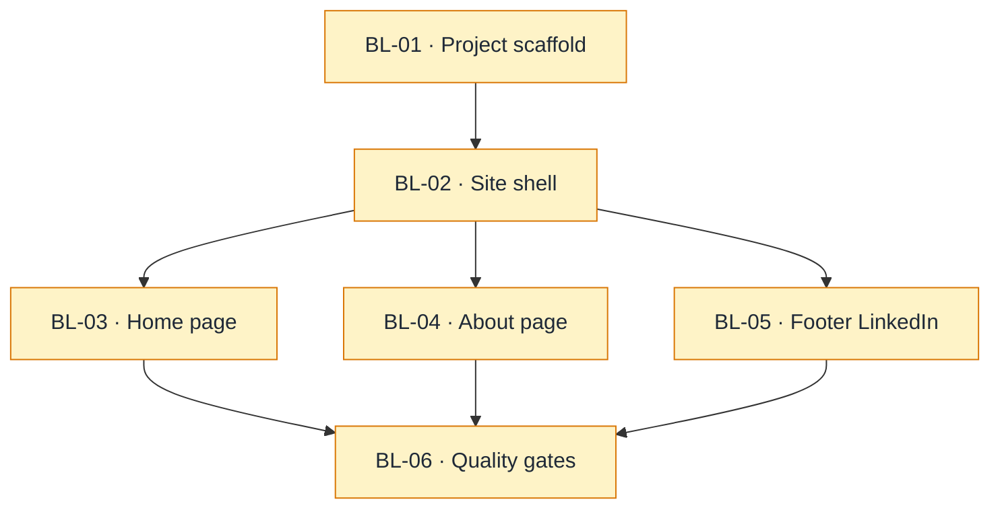

# Backlog

| ID | Feature | Title | Type | Priority | Status | Dependencies |
|----|---------|-------|------|----------|--------|--------------|
| BL-01 | — | Next.js project scaffold | Chore | Must | Todo | — |
| BL-02 | F01 | Site shell & layout | Story | Must | Todo | BL-01 |
| BL-03 | F02 | Home page | Story | Must | Todo | BL-02 |
| BL-04 | F03 | About page | Story | Must | Todo | BL-02 |
| BL-05 | F04 | Footer LinkedIn contact | Story | Should | Todo | BL-02 |
| BL-06 | — | Quality gates & regression tests | Chore | Must | Todo | BL-03, BL-04, BL-05 |

## Suggested implementation order

1. BL-01
2. BL-02
3. BL-03
4. BL-04
5. BL-05
6. BL-06

Respect **Dependencies** — a `BL-##` is not eligible until every listed dependency is `Done`.

## Dependency diagram

Node fill = **Status** (update `class` lines when status changes).

| Status | Color |
|--------|-------|
| Todo | Amber |
| In Progress | Blue |
| Done | Green |

| Item | Depends on | Notes |
|------|------------|-------|
| BL-01 | — | Root — `6-code/` Next.js + TypeScript + Tailwind per [ADR-01](../3-arch/solution-strategy.md#adr-01-nextjs-app-router-with-ssg-on-vercel)–[ADR-03](../3-arch/solution-strategy.md#adr-03-typescript-implementation) |
| BL-02 | BL-01 | Shared shell before route pages |
| BL-03 | BL-02 | Home renders in shell main slot |
| BL-04 | BL-02 | About renders in shell main slot; may parallel BL-03 after BL-02 |
| BL-05 | BL-02 | Footer LinkedIn extends BB-02.3; Should priority |
| BL-06 | BL-03, BL-04, BL-05 | Lighthouse, a11y, and E2E smoke after feature routes ship |

**Rules:** direct deps only; no transitive arrows; no cycles; **Depends on** = hard gate for implementation order.

---

## BL-01: Next.js project scaffold

**Feature:** — (enables F01–F04)
**Traces to:** [ADR-01](../3-arch/solution-strategy.md#adr-01-nextjs-app-router-with-ssg-on-vercel), [ADR-02](../3-arch/solution-strategy.md#adr-02-tailwind-css-styling), [ADR-03](../3-arch/solution-strategy.md#adr-03-typescript-implementation), [NFR-04](../3-arch/solution-strategy.md#nfr-04-static-architecture)
**Dependencies:** —
**Tests:** [TC-18](testing-plan.md#tc-18)
**Acceptance criteria:**

- [ ] Given an empty `6-code/` folder, when the Next.js App Router project is scaffolded with TypeScript and Tailwind, then `npm run build` completes without errors
- [ ] Given [library.md](../4-design/library.md) design tokens, when Tailwind theme is configured, then primary colours, typography, spacing, and `--breakpoint-mobile` (768px) match token values
- [ ] Given the project structure, when inspected, then there are no API routes, database dependencies, or CMS integrations ([NFR-04](../3-arch/solution-strategy.md#nfr-04-static-architecture))

---

## BL-02: Site shell & layout

**Feature:** [F01-site-shell-layout](../2-features/F01-site-shell-layout.md)
**Traces to:** [FR-F01-01](../2-features/F01-site-shell-layout.md#fr-f01-01)–[FR-F01-09](../2-features/F01-site-shell-layout.md#fr-f01-09)
**Dependencies:** BL-01
**Tests:** [TC-01](testing-plan.md#tc-01), [TC-02](testing-plan.md#tc-02), [TC-03](testing-plan.md#tc-03), [TC-04](testing-plan.md#tc-04), [TC-05](testing-plan.md#tc-05), [TC-06](testing-plan.md#tc-06), [TC-07](testing-plan.md#tc-07)
**Acceptance criteria:**

- [ ] Given any in-scope route (`/`, `/about`), when the page loads, then header, `<main>`, and footer landmarks are visible and main wraps route content ([FR-F01-01](../2-features/F01-site-shell-layout.md#fr-f01-01))
- [ ] Given any page, when the visitor clicks the **AI Friendly Docs** brand, then they navigate to Home ([FR-F01-02](../2-features/F01-site-shell-layout.md#fr-f01-02))
- [ ] Given the visitor is on About, when they view the header, then About is marked active and Home is not ([FR-F01-03](../2-features/F01-site-shell-layout.md#fr-f01-03))
- [ ] Given a viewport below 768px, when the page loads, then nav links are behind a hamburger menu until opened ([FR-F01-04](../2-features/F01-site-shell-layout.md#fr-f01-04))
- [ ] Given desktop width, when content renders, then text blocks do not exceed ~1200px centred while header/footer bands are full-bleed ([FR-F01-05](../2-features/F01-site-shell-layout.md#fr-f01-05))
- [ ] Given any page before F04, when the footer renders, then copyright (and tagline if present) appear and no LinkedIn link is shown ([FR-F01-06](../2-features/F01-site-shell-layout.md#fr-f01-06))
- [ ] Given Home and About, when the visitor switches routes, then header, footer, and shell styling remain consistent ([FR-F01-07](../2-features/F01-site-shell-layout.md#fr-f01-07))
- [ ] Given an invalid path, when the visitor opens it, then they see the shell plus a clear not-found message ([FR-F01-08](../2-features/F01-site-shell-layout.md#fr-f01-08))
- [ ] Given Home or About, when the page loads, then the browser title reflects the route name using the shared metadata template ([FR-F01-09](../2-features/F01-site-shell-layout.md#fr-f01-09))

---

## BL-03: Home page

**Feature:** [F02-home-page](../2-features/F02-home-page.md)
**Traces to:** [FR-F02-01](../2-features/F02-home-page.md#fr-f02-01)–[FR-F02-09](../2-features/F02-home-page.md#fr-f02-09)
**Dependencies:** BL-02
**Tests:** [TC-01](testing-plan.md#tc-01), [TC-08](testing-plan.md#tc-08), [TC-09](testing-plan.md#tc-09), [TC-10](testing-plan.md#tc-10), [TC-11](testing-plan.md#tc-11)
**Acceptance criteria:**

- [ ] Given the site is loaded, when the visitor opens `/`, then the F01 shell wraps Home sections ([FR-F02-01](../2-features/F02-home-page.md#fr-f02-01))
- [ ] Given Home loads, when the visitor reads the hero, then the headline leads with the documentation approach and the subhead mentions structured text and AI agent use ([FR-F02-02](../2-features/F02-home-page.md#fr-f02-02))
- [ ] Given Home loads, when the visitor activates the hero **Explore benefits** CTA, then the viewport scrolls to the benefits section and no contact CTA is present in the hero ([FR-F02-03](../2-features/F02-home-page.md#fr-f02-03))
- [ ] Given Home loads, when the visitor views benefits, then four distinct cards are visible and reflow on narrow viewports ([FR-F02-04](../2-features/F02-home-page.md#fr-f02-04))
- [ ] Given Home loads, when the visitor reads each benefit card, then rapid docs, test coverage, quality, and legacy modernization topics appear with title plus short prose ([FR-F02-05](../2-features/F02-home-page.md#fr-f02-05))
- [ ] Given Home loads, when the visitor reads how-it-works, then exactly three ordered steps appear: structured docs → AI elaboration → implementation and tests ([FR-F02-06](../2-features/F02-home-page.md#fr-f02-06))
- [ ] Given Home loads, when the visitor reaches the page bottom, then a link to About is visible and no contact form or LinkedIn CTA appears in the band ([FR-F02-07](../2-features/F02-home-page.md#fr-f02-07))
- [ ] Given Home loads, when document metadata is inspected, then title reflects Home using the shared template ([FR-F02-08](../2-features/F02-home-page.md#fr-f02-08))
- [ ] Given Home loads, when the hero CTA is activated, then the benefits section receives focus without navigation away from Home ([FR-F02-09](../2-features/F02-home-page.md#fr-f02-09))

---

## BL-04: About page

**Feature:** [F03-about-page](../2-features/F03-about-page.md)
**Traces to:** [FR-F03-01](../2-features/F03-about-page.md#fr-f03-01)–[FR-F03-09](../2-features/F03-about-page.md#fr-f03-09)
**Dependencies:** BL-02
**Tests:** [TC-01](testing-plan.md#tc-01), [TC-12](testing-plan.md#tc-12), [TC-13](testing-plan.md#tc-13)
**Acceptance criteria:**

- [ ] Given the site is loaded, when the visitor opens `/about`, then the F01 shell wraps About sections ([FR-F03-01](../2-features/F03-about-page.md#fr-f03-01))
- [ ] Given About loads, when the visitor reads the top of the page, then a distinct hero heading and intro line appear before section content ([FR-F03-02](../2-features/F03-about-page.md#fr-f03-02))
- [ ] Given About loads, when the visitor reads section 1, then the methodology is explained in prose without duplicating the entire Home benefits grid ([FR-F03-03](../2-features/F03-about-page.md#fr-f03-03))
- [ ] Given About loads, when the visitor reads section 2, then the narrative states the site demonstrates professional output quality ([FR-F03-04](../2-features/F03-about-page.md#fr-f03-04))
- [ ] Given About loads, when the visitor reads section 3, then owner roles and background appear and no author photo is shown ([FR-F03-05](../2-features/F03-about-page.md#fr-f03-05))
- [ ] Given About loads, when the visitor views the author section, then a low-emphasis LinkedIn link is present and no contact form or hero-level CTA appears ([FR-F03-06](../2-features/F03-about-page.md#fr-f03-06))
- [ ] Given About loads, when the visitor reaches the page bottom, then a link to `/` is visible ([FR-F03-07](../2-features/F03-about-page.md#fr-f03-07))
- [ ] Given About loads, when document metadata is inspected, then title reflects About using the shared template ([FR-F03-08](../2-features/F03-about-page.md#fr-f03-08))
- [ ] Given About loads, when sections are read top to bottom, then they appear in order: hero → What AI Friendly Docs is → Why this site exists → About the author → Home link band ([FR-F03-09](../2-features/F03-about-page.md#fr-f03-09))

---

## BL-05: Footer LinkedIn contact

**Feature:** [F04-optional-linkedin-contact](../2-features/F04-optional-linkedin-contact.md)
**Traces to:** [FR-F04-01](../2-features/F04-optional-linkedin-contact.md#fr-f04-01)–[FR-F04-07](../2-features/F04-optional-linkedin-contact.md#fr-f04-07)
**Dependencies:** BL-02
**Tests:** [TC-14](testing-plan.md#tc-14)
**Acceptance criteria:**

- [ ] Given any in-scope route (Home, About, 404), when the page loads, then the footer includes a LinkedIn link ([FR-F04-01](../2-features/F04-optional-linkedin-contact.md#fr-f04-01))
- [ ] Given any page, when the footer renders, then the link text is “LinkedIn” with subdued styling and no LinkedIn icon ([FR-F04-02](../2-features/F04-optional-linkedin-contact.md#fr-f04-02))
- [ ] Given desktop width, when the footer renders, then copyright and LinkedIn appear on one row; on mobile they stack readably ([FR-F04-03](../2-features/F04-optional-linkedin-contact.md#fr-f04-03))
- [ ] Given the footer link, when its href is inspected, then it matches the site owner LinkedIn profile URL ([FR-F04-04](../2-features/F04-optional-linkedin-contact.md#fr-f04-04))
- [ ] Given the visitor clicks the footer LinkedIn link, then a new tab opens to LinkedIn and the link includes `rel="noopener noreferrer"` ([FR-F04-05](../2-features/F04-optional-linkedin-contact.md#fr-f04-05))
- [ ] Given any page, when the footer renders, then only the subtle text link appears — no button-style CTA or form ([FR-F04-06](../2-features/F04-optional-linkedin-contact.md#fr-f04-06))
- [ ] Given the F01 footer frame, when F04 is implemented, then the link is part of footer content and header/nav are unchanged ([FR-F04-07](../2-features/F04-optional-linkedin-contact.md#fr-f04-07))

---

## BL-06: Quality gates & regression tests

**Feature:** — (cross-cutting)
**Traces to:** [NFR-02](../3-arch/solution-strategy.md#nfr-02-accessibility), [NFR-03](../3-arch/solution-strategy.md#nfr-03-performance-seo), [ADR-05](../3-arch/solution-strategy.md#adr-05-playwright-and-vitest-testing), [RT-01](../3-arch/runtime-views.md#rt-01-practitioner-cross-route-journey)
**Dependencies:** BL-03, BL-04, BL-05
**Tests:** [TC-15](testing-plan.md#tc-15), [TC-16](testing-plan.md#tc-16), [TC-17](testing-plan.md#tc-17)
**Acceptance criteria:**

- [ ] Given `/` and `/about` on mobile viewport, when Lighthouse audit runs, then Performance, Accessibility, and SEO scores are ≥ 90 ([NFR-03](../3-arch/solution-strategy.md#nfr-03-performance-seo))
- [ ] Given Home and About, when automated a11y checks and keyboard walkthrough run, then WCAG 2.1 AA violations are absent on nav, in-page links, and footer contact ([NFR-02](../3-arch/solution-strategy.md#nfr-02-accessibility))
- [ ] Given the Playwright and Vitest suites, when `npm test` (or CI equivalent) runs, then all mapped `TC-##` cases pass ([ADR-05](../3-arch/solution-strategy.md#adr-05-playwright-and-vitest-testing))
