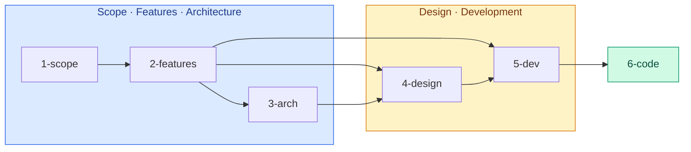
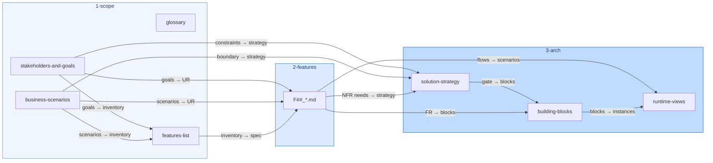
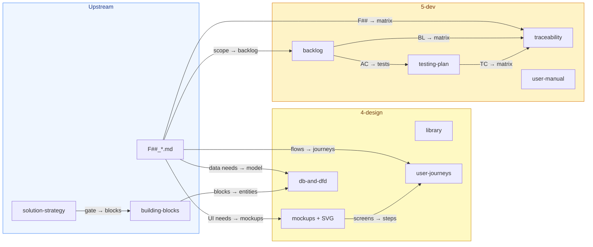
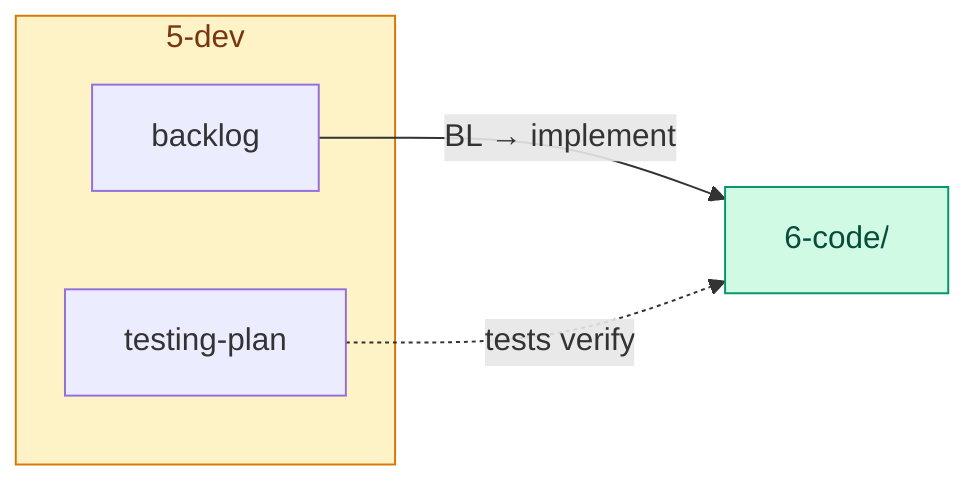

# Project Structure

Map of the documentation framework — phases, files, and how maintenance flows. **Step-by-step:** [How-tos](#how-tos). **Derivation map:** [Flows](#flows). **How to edit:** [.cursor/rules/](../.cursor/rules/). **Copy-paste shapes:** [templates.md](templates.md).


## Table of contents

- [Directory tree](#directory-tree)
  - [Consultation](#consultation)
  - [Product (scaffolded per product)](#product-scaffolded-per-product)
- [Flows](#flows)
  - [Overview](#overview)
  - [Scope · Features · Architecture](#scope--features--architecture)
  - [Design · Development](#design--development)
  - [Code](#code)
- [How-tos](#how-tos)
  - [1. Fill initial scope files](#1-fill-initial-scope-files)
  - [2. Break down features and get the feature list](#2-break-down-features-and-get-the-feature-list)
  - [3. Create a full feature description](#3-create-a-full-feature-description)
  - [4. Create solution strategy](#4-create-solution-strategy)
  - [5. Derive building blocks from features](#5-derive-building-blocks-from-features)
  - [6. Generate design documents from scope, features, and architecture](#6-generate-design-documents-from-scope-features-and-architecture)
  - [7. Create a backlog for implementation](#7-create-a-backlog-for-implementation)
  - [8. Validate documentation readiness for implementation](#8-validate-documentation-readiness-for-implementation)

---


## Directory tree

### Consultation

```
consultation/
├── structure.md    ← this file
└── templates.md
.cursor/rules/
├── 00-general.mdc
├── 01-interview.mdc
├── 02-features-list.mdc
├── 03-feature-lifecycle.mdc
├── 04-solution-strategy.mdc
├── 05-architecture-docs.mdc
├── 06-traceability.mdc
├── 08-backlog-implement.mdc
├── 07-verification-validation-levels.mdc
└── 10-design-mockups.mdc
```

### Product *(scaffolded per product)*

```
<product-root>/
├── open-questions.md   single file — Scope, Features, Architecture, Design, Development sections
├── 1-scope/          stakeholders-and-goals.md, business-scenarios.md,
│                     glossary.md, features-list.md
├── 2-features/       F##_feature-slug.md (one per features-list row)
├── 3-arch/           solution-strategy.md, building-blocks.md,
│                     runtime-views.md
├── 4-design/         library.md, mockups.md, user-journeys.md,
│                     db-and-dfd.md, mockups/
│                       screens/   MCK-##-*.svg
│                       components/ CMP-##-*.svg (optional)
├── 5-dev/            backlog.md, testing-plan.md, traceability.md,
│                     user-manual.md
└── 6-code/           (optional · TBD)
```


---

## Flows

What product files are derived from which upstream sources, and which Cursor rules govern each step. Generate `features-list.md` from goals and scenarios per [02-features-list.mdc](../.cursor/rules/02-features-list.mdc). Derive `solution-strategy.md` per [04-solution-strategy.mdc](../.cursor/rules/04-solution-strategy.mdc) before building-blocks and downstream architecture/design.

### Overview

Phase-level derivation — see nested diagrams below for file-level detail.



### Scope · Features · Architecture

Derivation within phases 1–3 (scope inputs → feature specs → solution strategy → building-blocks / runtime-views). Strategy must pass the [04-solution-strategy](../.cursor/rules/04-solution-strategy.mdc) ready gate before blocks.



### Design · Development

Derivation within phases 4–5 (feature and architecture inputs → design artifacts → dev planning). `db-and-dfd.md` requires [04-solution-strategy](../.cursor/rules/04-solution-strategy.mdc) ready gate and current building-blocks.



### Code

Implementation phase — backlog drives code; tests verify against acceptance criteria.



---

## How-tos

Step-by-step guides for filling the product tree. Every step starts with an **interview** in chat ([01-interview.mdc](../.cursor/rules/01-interview.mdc)): one question at a time, summarize, confirm, then write files. Copy shapes from [templates.md](templates.md).

### 1. Fill initial scope files

**Goal:** `1-scope/` documents that anchor every downstream artifact.

| Step | Action |
|------|--------|
| 1 | Run interview — stakeholders, goals, success metrics, constraints, assumptions, non-goals |
| 2 | Create `stakeholders-and-goals.md` — at least one `STK-##` and one `GOL-##`; add **Goal map** Mermaid stub |
| 3 | Create `business-scenarios.md` — **Context and Boundary** table; at least one `SCN-##` with actor, trigger, goal, main flow |
| 4 | Create `glossary.md` — domain terms and acronyms used in scope docs |
| 5 | Create root `open-questions.md` — record unresolved scope gaps as `Q-S##` rows only |
| 6 | Validate per [07-verification-validation-levels.mdc](../.cursor/rules/07-verification-validation-levels.mdc) Level 1 |

**Done when:** goals and scenarios exist; boundary is explicit; glossary covers key terms; open questions are listed, not hidden in prose.

**Rule:** [01-interview.mdc](../.cursor/rules/01-interview.mdc) · **Templates:** [stakeholders-and-goals](templates.md#stakeholders-and-goalsmd), [business-scenarios](templates.md#business-scenariosmd), [glossary](templates.md#glossarymd)

### 2. Break down features and get the feature list

**Goal:** `1-scope/features-list.md` — inventory of deliverable capabilities traced to goals and scenarios.

| Step | Action |
|------|--------|
| 1 | Confirm scope files are complete enough (≥1 `GOL-##`, ≥1 `SCN-##`) |
| 2 | Read goals, scenarios, non-goals, and boundary per [02-features-list.mdc](../.cursor/rules/02-features-list.mdc) |
| 3 | Draft one `F##` row per distinct user-visible or testable capability — map **Priority**, **Stakeholders**, **User Requirements (brief)**, **Requires** |
| 4 | Build **Dependencies** Mermaid from **Requires** (direct edges only; no cycles) |
| 5 | Present proposed table in interview summary; on confirm, write `features-list.md` with all rows **Status** `Draft` |
| 6 | Update **Related features** on each `SCN-##`; extend **Goal map** with `F##` nodes |
| 7 | Do **not** create `2-features/F##_*.md` yet unless the interview explicitly includes spec work |

**Reconcile later:** when scope changes, **preserve** established rows (those with a spec file); append new rows only.

**Rule:** [02-features-list.mdc](../.cursor/rules/02-features-list.mdc) · **Template:** [features-list.md](templates.md#features-listmd)

### 3. Create a full feature description

**Goal:** `2-features/F##_slug.md` with UR/FR, flows, and data — feature **Status** → **Dev-ready**.

| Step | Action |
|------|--------|
| 1 | Pick a `Draft` row from `features-list.md` (respect **Requires** order for sequencing work) |
| 2 | Interview — scope, actors, screens, data, error cases, out-of-scope deferrals |
| 3 | Create `F##_slug.md` from template; complete **Overview** (intent, scope, trace, blocks stub) → **Status** `Specifying` |
| 4 | Add **User requirements** (`UR-F##-##`) traced to `GOL-##` / `SCN-##` |
| 5 | Add **Functional requirements** (`FR-F##-##`) with Given/When/Then acceptance; link parent UR and target `BB-##` when known |
| 6 | Add **UI flow** (if user-facing), **Runtime flow**, and **Data model** sections |
| 7 | Sync **Requires** across frontmatter, Overview, table, and features-list dependency diagram |
| 8 | When all sections complete and cross-refs resolve, set **Status** → **Dev-ready** in list + frontmatter |

**Lifecycle:** [03-feature-lifecycle.mdc](../.cursor/rules/03-feature-lifecycle.mdc) · **Template:** [F##_feature-slug.md](templates.md#f_feature-slugmd)

### 4. Create solution strategy

**Goal:** `3-arch/solution-strategy.md` (arc42 §4) — NFRs, ADRs, stack — passes the **ready gate** before building blocks or design data model.

| Step | Action |
|------|--------|
| 1 | Confirm every **Must** `F##` has a spec with **Overview** and ≥1 UR |
| 2 | Read constraints, assumptions, boundary, and feature NFR needs per [04-solution-strategy.mdc](../.cursor/rules/04-solution-strategy.mdc) |
| 3 | Write **Context** — problem space, forces, boundary |
| 4 | Extract **NFR-##** rows — link each to affected `F##` |
| 5 | Record **ADR-##** for structural/tech choices; set status `Accepted` before calling strategy ready |
| 6 | Fill **Technology Stack** (every row cites an ADR), **Quality Goals**, **Risks** |
| 7 | Propagate NFR links to feature **Overview** **Trace** and `traceability.md` |
| 8 | Run [Ready checklist](../.cursor/rules/04-solution-strategy.mdc#ready-checklist); resolve or remove all `Q-A##` rows |

**Gate:** do not create or materially update `building-blocks.md`, `runtime-views.md`, or `db-and-dfd.md` until the ready checklist passes.

**Rule:** [04-solution-strategy.mdc](../.cursor/rules/04-solution-strategy.mdc) · **Template:** [solution-strategy.md](templates.md#solution-strategymd)

### 5. Derive building blocks from features

**Goal:** `3-arch/building-blocks.md` and `3-arch/runtime-views.md` — static decomposition and cross-cutting runtime scenarios.

**Pre-flight:** solution strategy ready ([04-solution-strategy.mdc](../.cursor/rules/04-solution-strategy.mdc#ready-checklist)).

**Building blocks**

| Step | Action |
|------|--------|
| 1 | Read features-list → all `F##_*.md` → scenarios → solution-strategy per [05-architecture-docs.mdc](../.cursor/rules/05-architecture-docs.mdc) |
| 2 | Extract participants, APIs, stores, cross-cutting capabilities from feature runtime/UI/data sections |
| 3 | Cluster into ~5–12 L1 blocks (`BB-##`); external systems in **External Systems**, not internal L1 |
| 4 | Document Level, Parent, Type, responsibility, Features, Interfaces, Dependencies |
| 5 | Propagate **Blocks** links back into each feature **Overview** |

**Runtime views**

| Step | Action |
|------|--------|
| 1 | Feature-local happy paths stay in each `F##_*.md` **Runtime flow** |
| 2 | Cross-feature, external, async, security, or ops flows → `runtime-views.md` as `RT-##` |
| 3 | Map every participant to `BB-##` or `(external)`; add trigger, interactions, notable aspects |

**Rule:** [05-architecture-docs.mdc](../.cursor/rules/05-architecture-docs.mdc) · **Templates:** [building-blocks.md](templates.md#building-blocksmd), [runtime-views.md](templates.md#runtime-viewsmd)

### 6. Generate design documents from scope, features, and architecture

**Goal:** `4-design/` — library, mockups, journeys, data model — traced to `F##`, `FR`, and `BB`.

**Pre-flight:** solution strategy ready; `building-blocks.md` current ([10-design-mockups.mdc](../.cursor/rules/10-design-mockups.mdc)).

| Step | Action |
|------|--------|
| 1 | **library.md** — design tokens, screen inventory, component catalog (`CMP-##`) |
| 2 | **mockups.md** — index row per screen (`MCK-##`) traced to `F##`, `FR`, and journey; add **Layout (planned)** before SVG |
| 3 | Create SVGs under `mockups/screens/` (and optional `components/`, `journeys/`) per naming rules |
| 4 | **user-journeys.md** — `JRN-##` steps linked to `MCK-##`; **Visual flow** storyboard |
| 5 | **db-and-dfd.md** — entities from feature data models + BB stores; DFD aligned to runtime; data dictionary |
| 6 | Wire feature **UI flow** → mockup anchors; propagate token changes across library, SVGs, journeys |

**UI-heavy features first:** MVP paths on primary journeys; defer vNext screens until scope is active.

**Rule:** [10-design-mockups.mdc](../.cursor/rules/10-design-mockups.mdc) · **Templates:** [library.md](templates.md#librarymd), [mockups.md](templates.md#mockupsmd), [user-journeys.md](templates.md#user-journeysmd), [db-and-dfd.md](templates.md#db-and-dfdmd)

### 7. Create a backlog for implementation

**Goal:** `5-dev/backlog.md` (+ `testing-plan.md`, `traceability.md`) — ordered, verifiable work items for `6-code/`.

| Step | Action |
|------|--------|
| 1 | Start from **Dev-ready** features — split each into one or more `BL-##` stories/tasks sized for a single implementation pass |
| 2 | Each item cites **Feature**, **Traces to** (`FR-F##-##`), **Tests** (`TC-##`), and verifiable **Acceptance criteria** (Given/When/Then from FR) |
| 3 | Set **Dependencies** — direct `BL-##` only; respect feature **Requires** gate and technical order (e.g. data layer before UI) |
| 4 | Build summary table, **Suggested implementation order**, and dependency diagram (status-colored nodes) |
| 5 | Add matching `TC-##` rows in `testing-plan.md` |
| 6 | Update `traceability.md` matrix — `GOL → SCN → UR → FR → BL → TC` per [06-traceability.mdc](../.cursor/rules/06-traceability.mdc) |
| 7 | Record unresolved dev gaps as `Q-V##` in `open-questions.md` (e.g. scaffold path for `6-code/`) |

**Implement later:** pick the first eligible `Todo` `BL-##` per [08-backlog-implement.mdc](../.cursor/rules/08-backlog-implement.mdc).

**Templates:** [backlog.md](templates.md#backlogmd), [testing-plan.md](templates.md#testing-planmd), [traceability.md](templates.md#traceabilitymd)

### 8. Validate documentation readiness for implementation

**Goal:** confirm the doc set is complete before writing code under `6-code/`.

Run the leveled gate in [07-verification-validation-levels.mdc](../.cursor/rules/07-verification-validation-levels.mdc) — **Level 1 → 11 in order**; stop at first failure and record gaps in `open-questions.md`:

| Level | Area |
|-------|------|
| 1 | Scope — goals, scenarios, features-list coverage |
| 2 | Feature specs ↔ features-list and scope |
| 3 | Solution strategy ready |
| 4–5 | Building blocks, runtime views, feature ↔ BB links |
| 6 | End-to-end traceability to stakeholders and strategy |
| 7–9 | UI readiness, user journeys, mockup SVGs |
| 10 | Backlog, implementation order, tests |
| 11 | Critical open questions cleared for `6-code/` |

**Implementation gate:** the first `BL-##` pre-flight ([08-backlog-implement.mdc](../.cursor/rules/08-backlog-implement.mdc)) should pass without cancellation — upstream feature, FR, BB, design refs, and ADRs all resolve.

**When ready:** feature **Status** may move to **In development** when ≥1 linked `BL-##` is `In Progress` or `Done` and all **Requires** are **Implemented**.

